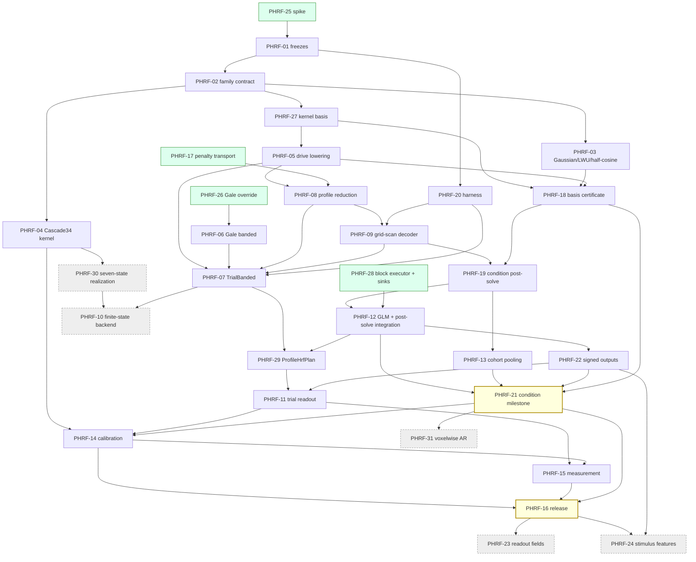

# ProfileHrf work-item graph, revision 2 (draft)

Draft 2026-09-10, revised the same day after review, following
[profile-hrf-review.md](profile-hrf-review.md).
Supersedes [profile-hrf-work-items.md](profile-hrf-work-items.md) once
approved; not yet applied to the Mote epic `bd-01M24MQABKEBQXW89VZ8XWBB8H`.
Existing PHRF-01..24 keep their IDs and Mote handles where scope survives.
New tickets PHRF-25..31 have no Mote handle yet.

Design basis: the kernel-basis formulation. A family `h_theta ~= Phi c(theta)`
with `Phi` from an SVD of the sampled family and its parameter derivatives;
condition fitting reuses the basis-expanded sufficient statistics
(`BasisExpandedFitProduct`: task Gram, per-voxel cross-products, response
squares, non-task rank) or a rank-revealing `(U, R, z, e)` retained from one
shared pass, followed by a coefficient-space post-solve; trial fitting uses
shared banded Gram blocks of the trial-basis design. The experiment-specific
`U` is an internal numerical representation, never a scientific basis.
Scientific contracts are unified; each backend justifies its execution policy
by measurement against absolute and ratio targets. `Cascade34` is a kernel first and a finite-state backend only if the
measured trial crossover justifies it.

## Summary of changes from revision 1

| Ticket | Disposition | Reason |
| --- | --- | --- |
| PHRF-01 | Revised, no longer first | Shrunk to the freezes the spike cannot settle; depends on PHRF-25. |
| PHRF-02 | Revised | Adds `evalInto` and parameter-derivative evaluation to the family contract. |
| PHRF-03 | Revised, off the condition critical path | Second derivatives feed jets, not the grid-scan decoder. Half-cosine admitted derivative-free. |
| PHRF-04 | Split | Kernel, params and summaries stay required and gate PHRF-14; the seven-state realization moves to PHRF-30 (optional). |
| PHRF-05 | Revised | Lowers drives through the basis expansion: `A_tilde` for conditions, sparse `X_tilde` for trials. |
| PHRF-06 | Revised | Upstream Gale implementation, not inspection: banded SPD Cholesky, multi-RHS solve, logdet. Depends on PHRF-26. |
| PHRF-07 | Revised | Gram blocks of `X_tilde`; per-voxel exact factor at `theta_hat` is a measured option. |
| PHRF-08 | Revised | Jets in coefficient space; same formulas and laws. |
| PHRF-09 | Revised | Grid scan plus safeguarded bounded refinement replaces the router and the two-reference cap. |
| PHRF-10 | Deferred | Finite-state innovation backend; decided at the PHRF-07 dense-overlap benchmark checkpoint, not at final qualification. |
| PHRF-11 | Kept | Trial readout and queries. |
| PHRF-12 | Revised | Condition path integrates as GLM plus post-solve stage; no new `FitStrategy` case for PHRF-21. |
| PHRF-13 | Revised | Full-cohort node-score pooling replaces the pilot restriction in condition mode. |
| PHRF-14, 15, 16 | Rewritten | Scopes restated without finite-state requirements; absolute targets retained. |
| PHRF-17 | Kept, now Ready | Independent of everything else. |
| PHRF-18 | Revised | Experiment-level certification in `fit`: direct-design versus basis projectors at each shape under fitted geometry. Kernel-level certificate moves to PHRF-27. |
| PHRF-19 | Revised | Post-solve runtime consuming retained sufficient statistics, not unrestricted coefficients. |
| PHRF-20 | Revised | JMH on JVM, hand-rolled timer on JS; absolute and ratio targets; complete work counters. |
| PHRF-21, 22 | Kept | Condition milestone and signed outputs. |
| PHRF-23, 24 | Kept optional | Unchanged. |
| PHRF-25 | New, Ready | Time-boxed end-to-end spike. |
| PHRF-26 | New, Ready | Gale local-override in `build.sbt` and provider pin workflow. |
| PHRF-27 | New | Kernel-basis builder as a `ResponseBasis` in `design`. |
| PHRF-28 | New, Ready | Bounded block executor and sink/receipt lifecycle; independent of the freezes. |
| PHRF-29 | New | `ProfileHrfPlan` sibling in `model` for the trial regime. |
| PHRF-30 | New, optional | Exact seven-state `Cascade34` realization (split from PHRF-04). |
| PHRF-31 | New, optional | Voxelwise AR through lag-Gram expansion. |

Required: 26 tickets. Optional or deferred: 5. The longest chain to the
condition milestone PHRF-21 is eleven tickets and touches no trial, banded
or finite-state work. PHRF-03 does gate PHRF-21 (through PHRF-18): the
milestone qualifies Gaussian and LWU, which PHRF-03 admits. Only its second
derivatives are off the longest chain.

## Ticket table

| Ticket | Mote ID | Depends on | Scope |
| --- | --- | --- | --- |
| PHRF-25: Spike the kernel-basis condition fit end to end | new | Ready | Required |
| PHRF-17: Repair coefficient-penalty transport and qualify normalization invariance | `bd-01M25Q0ETQHAQ084S6S5MVPXD8` | Ready | Required |
| PHRF-26: Add Gale local-override and provider pin workflow to the build | new | Ready | Required |
| PHRF-01: Freeze estimands, criteria, units and measurement cohorts | `bd-01M24MRG6N43785BB75ZCZYK2J` | PHRF-25 | Required |
| PHRF-20: Establish benchmark harness, work counters and ratio targets | `bd-01M25Q0HX1P7AB9HPBRWRZPH1N` | PHRF-01 | Required |
| PHRF-02: Add the parametric family contract with vectorized evaluation and parameter jets | `bd-01M24MRJ6BWQ2M6BSAR03CWQZF` | PHRF-01 | Required |
| PHRF-03: Admit Gaussian and LWU parameter derivatives and half-cosine charts | `bd-01M24MRN5PT063KQG00N9TMQ5D` | PHRF-02 | Required |
| PHRF-04: Implement the continuous Cascade34 kernel and its summaries | `bd-01M24MRR3DPF01JA51ACZZ46A2` | PHRF-02 | Required |
| PHRF-27: Build the kernel basis as a certified `ResponseBasis` | new | PHRF-02 | Required |
| PHRF-18: Certify observed condition families under fitted geometry | `bd-01M25Q0FVB7MPEQ3PQCCJR6WDZ` | PHRF-27, PHRF-03, PHRF-05 | Required |
| PHRF-05: Lower drives through the basis into condition and trial designs | `bd-01M24MRV17VNXFCB44QXVV5RZS` | PHRF-27 | Required |
| PHRF-08: Implement the coefficient-space profile reduction, criteria and dense laws | `bd-01M24MS0YSMYZ7DGB130Q12K79` | PHRF-05, PHRF-17 | Required |
| PHRF-09: Build the grid-scan decoder with safeguarded bounded refinement | `bd-01M24MSAQZ2MF2KGQEG1K33E6C` | PHRF-08, PHRF-20 | Required |
| PHRF-28: Add a bounded block executor with sink and receipt lifecycle | new | Ready | Required |
| PHRF-19: Implement the condition post-solve runtime and readout | `bd-01M25Q0GVNRDS6Q8PXN7SFC84X` | PHRF-09, PHRF-18 | Required |
| PHRF-13: Pool node scores across the cohort and freeze response-derived preparation | `bd-01M24MSVV1BRRGPFRW6A27DCX9` | PHRF-19 | Required |
| PHRF-12: Integrate the condition path as GLM plus post-solve stage | `bd-01M24MSQS8HFQBPY2TAVW1FJGM` | PHRF-19, PHRF-28 | Required |
| PHRF-22: Define signed condition/trial query outputs with direct sinks | `bd-01M25Q0M14Q0A7TZX387W9CSST` | PHRF-12 | Required |
| PHRF-21: Qualify the condition-only milestone | `bd-01M25Q0JY8GA7CJRKZF2934PJ0` | PHRF-12, PHRF-13, PHRF-22, PHRF-18 | Required |
| PHRF-06: Implement banded SPD factors, solves and logdet upstream in Gale and pin | `bd-01M24MRY1DA0KPP37J7H8G619D` | PHRF-26 | Required |
| PHRF-07: Implement the TrialBanded backend on shared Gram blocks | `bd-01M24MS4WEQN14GH3P56K1257J` | PHRF-05, PHRF-06, PHRF-08, PHRF-09, PHRF-20 | Required |
| PHRF-29: Add `ProfileHrfPlan` and attach the trial backend to the executor | new | PHRF-07, PHRF-12 | Required |
| PHRF-11: Add trial amplitudes, ML determinant and queries to the readout contract | `bd-01M24MSJQZH70BTAFYTXD3MPZZ` | PHRF-29, PHRF-22 | Required |
| PHRF-14: Qualify numerical approximation and scientific calibration | `bd-01M24MSZ4Z6BFWRV5R4S67VDN0` | PHRF-04, PHRF-11, PHRF-21 | Required |
| PHRF-15: Measure throughput, memory and backend crossovers | `bd-01M24MT58X8W2Z0KJ25JJG2SGP` | PHRF-11, PHRF-14 | Required |
| PHRF-16: Release unified ProfileHrf | `bd-01M24MTB363KSHN1KDRSAM2KNH` | PHRF-14, PHRF-15, PHRF-21 | Required |
| PHRF-30: Optional: exact seven-state Cascade34 realization | new | PHRF-04 | Optional |
| PHRF-10: Deferred: finite-state innovation likelihood backend | `bd-01M24MSDQ0A8NK9YWT0SB4FCRX` | PHRF-30, PHRF-07 | Deferred |
| PHRF-31: Optional: voxelwise AR through lag-Gram expansion | new | PHRF-21 | Optional |
| PHRF-23: Optional: frozen readout fields for matrix-free MVPA | `bd-01M25Q0N1MG005XYTYE8HBS2ZB` | PHRF-16 | Optional |
| PHRF-24: Optional: bounded stimulus-feature amplitude structure | `bd-01M25Q0P2ANA5VBKFZR7ZXNW8J` | PHRF-16, PHRF-22 | Optional |

## Dependency graph

Critical path to PHRF-21: 25 -> 01 -> 02 -> 27 -> 05 -> 08 -> 09 -> 19 -> 12 -> 22 -> 21.
PHRF-17, 26 and 28 are Ready and run in parallel with the spike. PHRF-20
starts after PHRF-01. Trial work (06, 07, 29, 11) can start once
PHRF-05/08/09 land and never blocks PHRF-21. The finite-state decision is
taken at the PHRF-07 benchmark checkpoint.

## Ticket definitions

Each ticket lists owner, acceptance, and the performance rule it must satisfy.
"Both platforms" means JVM and JS suites pass. Work budgets are counters with a
default and a reported actual, never structural prohibitions.

### PHRF-25: Spike the kernel-basis condition fit end to end

Owner: one engineer, time-boxed to five working days; throwaway branch, no
public API. Acceptance:

- Causal Gaussian family only; `theta = (tau, log sd)`; fine-grid sampling of
  `h_theta` and its analytic first derivatives; SVD basis `Phi`; report `m` at
  1e-3, 1e-4 and 1e-5 relative kernel error over a declared domain and `T_h`.
- One shared pass retains sufficient statistics under the existing shared AR
  whitening: either a `BasisExpandedFitProduct` (task Gram, per-voxel
  cross-products, response squares, non-task rank) or a rank-revealing
  `(U, R, z, e)`. The spike must establish that the retention path composes
  with shared whitening and does not require a positive-definite expanded
  Gram or unique unrestricted coefficients: `A_tilde` may be rank deficient
  while `D(theta)` is identifiable at a given shape.
- Post-solve: grid scan over 64 nodes, one safeguarded Newton step with exact
  re-evaluation, `K x C` readout. Compared against a dense time-domain
  nonlinear least-squares oracle on 200 synthetic voxels at three SNRs.
- Runs on JVM and JS (Node) with wall time and work counters per phase for
  `T = 600, C = 3, V = 10,000`, counting family evaluation for `c(theta)`,
  compact design assembly, QR, node scan, jets, exact evaluations, readout,
  pooling storage and certification. Reports extrapolated absolute time at
  `V = 100,000` against the 30-second C0 goal; MAC estimates are not times.
- Fixed accuracy requirements from the original plan apply to the spike's
  cohort: p95 peak latency `<= 0.02 s`, FWHM `<= 0.05 s`, amplitude L2
  `<= 0.1%` against the dense oracle on locally identifiable voxels.
- Deliverable is a short note in `docs/plans/` with `m`, `K`, tail bound,
  measured cost split, accuracy against the oracle, and a go/no-go on two
  separate questions: kernel-basis lowering, and a bounded grid scan replacing
  the condition router. Code is deleted or moved into PHRF-27/19 explicitly.

Performance rule: the spike reports the ratio of post-solve to GLM time; if it
exceeds 2x, PHRF-19's design changes before PHRF-01 freezes anything.

### PHRF-17: Repair coefficient-penalty transport and qualify normalization invariance

Unchanged from revision 1. Owner: `hrf`. Fix `BasisTransform.Diagonal.transportPenalty`
to inverse congruence, keep covariance forward, add scalar and non-diagonal
quadratic-form regressions and round-trips, fail explicitly on zero or
nonfinite scales. Both platforms.

### PHRF-26: Add Gale local-override and provider pin workflow to the build

Owner: build. Acceptance:

- `build.sbt` gains a `scalafim.gale.build` system property mirroring the Ravel
  and locus4s override pattern, so a local Gale checkout can be substituted for
  the pinned `uri(...#rev)`.
- A documented procedure: develop upstream, run affected scalafim suites
  against the local checkout, open the Gale PR, bump `galeRevision` after
  merge, run `sbt scalafimCompileAll` and the affected suites again.
- `README.md` "Common Commands" and AGENTS.md mention the property.

Performance rule: none. This unblocks PHRF-06.

### PHRF-01: Freeze estimands, criteria, units and measurement cohorts

Owner: plan. Acceptance (reduced from revision 1):

- Amplitude-structure ADT: `ConditionMeans` exact at `alpha = 0`,
  `ConditionCenteredTrials(positiveAlpha)`; one shape group per voxel; one-hot
  membership stored as indices.
- Criteria: `PenalizedProfile` and `TrialRandomEffectsML` with the full-data
  determinant. `sigma` is frozen from an independent preparation step in both
  regimes because it sets the prior weight and therefore the estimate. The
  nonlinear-least-squares plug-in `RSS(theta_hat) / (T - rank(F) - C - d)`
  is reported as a labeled selection-dependent conditional estimate; it is
  not admitted as calibrated until PHRF-14 shows coverage.
- Normalization and penalty units: shape scoring on the unnormalized kernel at
  `alpha = 0`; `lambda` declared in unnormalized kernel units for trials with
  the `s^2` conversion rule.
- Cohorts C0 and B0 as before. Absolute targets stay gating: condition
  `<= 30 s` compute at C0, trial `<= 120 s` at B0, `<= 256 MiB` engine live
  memory, on the frozen host. Ratios are reported alongside as overhead
  diagnostics: condition total versus the fixed-HRF basis GLM with the same
  `Phi`, trial one-reference `<= 12x` and two-reference `<= 24x` the same
  backend's fixed-shape fit. Changing an absolute target requires a recorded
  decision with old and new values after measurement.
- Backend-specific work budgets per voxel with defaults: condition `<= 64`
  compact node scores, `<= 2` jets, `<= 6` exact compact evaluations; trial
  `<= 8` bank value evaluations, `<= 2` jets, `<= 1` amplitude correction,
  per-voxel factorization only as a measured experimental mode. Every budget
  is a counter with a reported actual.
- Accuracy co-gates unchanged: `>= 95%` admitted on locally identifiable
  cohorts, p95 peak latency `<= 0.02 s`, FWHM `<= 0.05 s`, amplitude L2
  `<= 0.1%` against the same-model oracle.

Performance rule: budgets are counters reported in receipts.

Decisions taken from PHRF-25 on 2026-09-10 (assumed defaults; revisit if you disagree):

- D1 Rank cap and tolerance. The kernel-basis tolerance is chosen from the
  amplitude gate: default value tolerance 1e-3 with a held-out certificate
  (spike: m = 19, K = 57 at C = 3, p95 amplitude 2.2e-4 at SNR 0.5). K <= 96
  stays as the C0 capacity cap; C = 8 over the full Gaussian domain gives
  K = 152 and is refused in v1 rather than admitted by relaxing tolerance.
  Narrowing the domain is the admitted route to C = 8.
- D2 Condition budget per voxel. <= 90 node scores from a hierarchical scan of a
  <= 15x15 bank, <= 2 jets (one node jet from the precomputed bank, one full
  observed-Hessian jet), <= 2 exact compact evaluations on the nominal path
  (plus <= 4 in the rare fallback). The "<= 8 references, <= 2 evaluated"
  rule is retired for the condition backend; trial budgets are unchanged.
- D3 Admission rule (provisional). Accepted = positive observed curvature at
  theta_hat, interior of the chart, conditional sd(tau) <= 0.5 s. Calibrated
  in PHRF-14; 60% admission at SNR 0.25 is the rule working, not a defect,
  until calibration says otherwise.
- Default decoder variant: 15x15 hierarchical scan, two full Newton steps
  (docs/plans/profile-hrf-spike-results.md).

### PHRF-20: Establish benchmark harness, work counters and ratio targets

Owner: `benchmarks/fit-jvm` and a new JS timer. Acceptance:

- JMH benchmarks for GLM projection, node scan, jets, refinement, readout,
  pooling, sinks; JS `munit`-driven timer with warmup and five measured runs
  reporting median and p95.
- `WorkCounters` receipt type: value evaluations, jets, exact evaluations,
  factorizations, solves, response passes, output bytes, retained workspace
  bytes; checked against PHRF-01 budgets independently of wall time.
- Peak engine memory and process RSS reported separately; preparation, GLM,
  post-solve, pooling, sinks and IO timed separately.
- Denominators for ratios: the fixed-HRF basis GLM with the same `Phi` on the
  same data. Absolute C0/B0 wall-time cells are the gating figures; ratios
  cannot substitute for them because a larger basis inflates the denominator.
- Counted work includes family evaluation for `c(theta)`, compact design
  assembly, QR, trial scores, pooling storage and second-pass reads,
  certification and output conversion. Nothing is excluded as preparation.

Performance rule: no build or startup time in steady-state numbers.

### PHRF-02: Add the parametric family contract with vectorized evaluation and parameter jets

Owner: `hrf` shared. Acceptance:

- `ParametricHrfFamily` (name to match the module's descriptor conventions):
  validated parameter type, chart with bounds, `evalInto(times, out)`,
  `jetInto(times, value, grad, hess)` for `d <= 3` with ten components, support
  and declared `T_h` tail bound, normalization rule with its derivative.
- Distinct from `HrfDescriptor`, `ResponseBasis`, `Deriv` and `LwuBasis`; none
  are repurposed. Chain-rule and normalization tests independent of the family
  implementation.
- Allocation-free after workspace construction; no `Vec` per lag.
- Both platforms; `hrf-laws` extended with parameter-derivative consistency
  laws (finite-difference step sweeps with `NumericalEvidence` budgets).

Performance rule: evaluating one family point at `T_h_fine` samples is one
pass with no allocation.

### PHRF-03: Admit Gaussian and LWU parameter derivatives and half-cosine charts

Owner: `hrf`. Acceptance:

- Causal Gaussian and two-Gaussian LWU with analytic first and mixed second
  parameter derivatives; one shared `rho`; peak, FWHM and undershoot summaries
  with parity fixtures against `fmrihrf` distinguishing raw agreement from
  intentional causality differences.
- Half-cosine: six-parameter identity retained; explicit tied charts; first
  derivatives where they exist; second derivatives marked unavailable so the
  decoder uses derivative-free refinement. No `NonsmoothCell` machinery needed.
- Tail bounds for values and derivatives per declared domain and `T_h`.

Performance rule: no dense design construction; derivative cost recorded.

### PHRF-04: Implement the continuous Cascade34 kernel and its summaries

Completed 2026-09-12: [kernel implementation and numerical evidence](profile-hrf-cascade34-evidence.md).

Owner: `hrf`. Acceptance:

- `h(t) = g_3(t; kp) - rho g_4(t; ku)`, unit-area components, `kp > ku > 0`,
  `rho >= 0`; chart `(log kp, logit(ku/kp), rho)`; analytic parameter jets;
  peak, width, undershoot summaries; tail-rate nonidentification at `rho = 0`.
- `HrfKind`/`HrfParams` cases with exhaustive dispatch; analytic primitive for
  `BoxHeight`/`BoxMass`.
- Closed-form Erlang, area, causality and derivative tests on both platforms.

Performance rule: same as any kernel. The seven-state realization is PHRF-30.

### PHRF-27: Build the kernel basis as a certified `ResponseBasis`

Owner: `design` shared (has Gale). Acceptance:

- `HrfKernelBasis.compile(family, domain, T_h, fineDt, tolerance)`: sample
  values and first (optionally second) parameter derivatives on a deterministic
  `theta` grid, SVD via Gale, truncate to `m` by declared relative error, order
  columns by singular value (nested), return a `ResponseBasis` with provenance
  (family, version, chart, domain, `T_h`, `fineDt`, `m`, tolerance, error).
- `coefficients(theta): c`, `coefficientJet(theta): (c, c_p, c_pq)` from the
  family's jets and `Phi`.
- Kernel-level certificate (no observation geometry): held-out `theta` points
  off the compile grid, kernel and derivative relative error, tail bound
  versus `T_h` including slow undershoots, nested-order error curve. This is
  necessary, not sufficient; geometry-dependent certification is PHRF-18.
- Budget: `m <= 32` per family; `CompilationBudgetExceeded` on failure, never
  silent truncation.
- Both platforms; deterministic across platforms up to a declared tolerance.

Performance rule: compile once per family/domain/`T_h`/`fineDt`; cached by
fingerprint; no per-voxel cost.

### PHRF-18: Certify observed condition families under fitted geometry

Owner: `fit` (geometry-dependent) with laws in `first-level-laws`. Kernel
compression simplifies preparation; it does not remove observed-family
validation. Acceptance:

- At held-out shapes, compare the projector of the **direct** condition design
  `(I - Q_F Q_F') W_0 B(theta)` against the projector of its basis
  approximation `(I - Q_F Q_F') W_0 A_tilde (I kron c(theta))`, not merely the
  projector of `A_tilde`. Small design error can produce order-one projector
  error near aliasing; require singular-value and conditioning margins per
  admitted cell and refuse rank-changing cells.
- Checks under the actual whitening, nuisance columns, masks, run boundaries,
  off-grid onsets, pulses and tails; record empirical-versus-uniform evidence
  separately.
- `K = rank` of the projected expanded design reported for C0 at `C = 3` and
  `C = 8`; rank deficiency of `A_tilde` is allowed when `D(theta)` is
  identifiable at the tested shapes; failure is a typed refusal.

Performance rule: certification is bounded, runs once per geometry, and its
cost is counted in preparation.

### PHRF-05: Lower drives through the basis into condition and trial designs

Owner: `design`. Acceptance:

- `HrfDrivePlan` with condition aggregation and trial lowering as before;
  condition design `A_tilde = [S_1 Phi ... S_C Phi]` built with the existing
  prepared-convolution path; trial-basis design `X_tilde` stored sparse with
  per-column support windows, never dense `T x Nm`.
- Identity tests: `A_tilde (I kron c(theta))` equals the direct convolution of
  `Phi c(theta)` to basis error; summing trial contributions before convolution
  equals `X(theta) M`; run resets, censoring skip, pulses, off-grid onsets.
- Membership as indices; `TrialId`, `ConditionId`, run scope preserved.

Performance rule: aggregation once per geometry; no `T x N` allocation in
condition mode; sparse `X_tilde` storage `O(N m T_h)`.

### PHRF-08: Implement the coefficient-space profile reduction, criteria and dense laws

Owner: `fit/profile` and `model` declarations. Acceptance:

- `ProfileJet` (value, gradient, symmetric Hessian, reference, chart, rank,
  receipt); `E = s - b' G^-1 b` with the plan's derivative formulas; condition
  form `s = e`, `b = D' z`, `G = D' D` with `D = R (I kron c)`; trial form with
  `s(theta)` derivatives and a regression that fails when they are omitted.
- Criterion assembly adds `sigma` scaling and the determinant jet once;
  amplitude-structure ADT as frozen in PHRF-01.
- Dense laws in `first-level-laws`: augmented least squares, exact `alpha = 0`,
  rank failures, sign and permutation invariance, unequal/singleton/coincident
  conditions, `NumericalEvidence` budgets.

Performance rule: jet evaluation from one `K`-vector `R' z` per voxel plus
`10 * C * m` contractions; no dense `K x K` derivative matrices.

### PHRF-09: Build the grid-scan decoder with safeguarded bounded refinement

Owner: `fit/profile`. Acceptance:

- Value scan over all `G` bank nodes via stacked orthonormal node projectors;
  ambiguity gap between best and second-best basin reported.
- Refinement: at most two jets and at most six exact evaluations; Newton step
  accepted only if the exact energy improves consistently with the quadratic
  prediction; derivative-free quadratic interpolation through neighboring
  nodes when second derivatives are unavailable (half-cosine).
- Box constraints for `d <= 3` with face enumeration; prior subtracted with
  correct sign; data-only versus prior-augmented curvature; statuses
  `AcceptedLocal`, `WeaklyIdentified`, `PriorDominated`, `BoundaryCandidate`,
  `AmbiguousCells`, `RankDeficientMeans`, `ApproximationBudgetExceeded`.
- Initialization heuristic, labeled as such: the top singular pair of the
  reshaped `m x C` unrestricted coefficients (the `hrfals` LS+SVD step) picks
  the starting node by cosine with `c(theta_g)`. It is **not** an optimal
  shared-shape fit or an energy bound: the fitting metric is
  `(b_hat - b)' G (b_hat - b)`, not Euclidean coefficient distance, and a
  counterexample with SVD residual energy 100 versus an admissible rank-one
  energy 4 exists.
- Adequacy diagnostic: the energy gap between the unrestricted basis fit and
  the parametric fit, with its null distribution calibrated in PHRF-14 before
  any scientific interpretation. An optional `G`-metric rank-one fit by
  bounded alternating least squares (CF-ALS, `<= 5` sweeps) may be admitted
  later as a labeled diagnostic with its own counter.
- Deterministic on both platforms; work counters from PHRF-20.

Performance rule: condition budgets from PHRF-01 (`<= 64` compact scores,
`<= 2` jets, `<= 6` exact evaluations) by counter; trial budgets are separate
because a trial-profile evaluation is a different workload from a compact
score.

### PHRF-28: Add a bounded block executor with sink and receipt lifecycle

Owner: `fit`. Acceptance:

- `BlockSink` contract: accept a completed block payload, return a small
  receipt; in-memory and supplied-sink implementations; cancellation and sink
  failure propagate as typed errors.
- JVM: bounded work queue over blocks with `<= 8` workers and `<= 256` voxels
  per block, no `Vector` of all payloads; JS: single worker, same contract.
- Block-order parity: per-block partial sums reduced in a fixed order so
  results are identical across worker counts.
- Reuses the existing transactional sink/catalog work where applicable.

Performance rule: live memory bounded by workers times block workspace plus
accumulators; measured by PHRF-20.

### PHRF-19: Implement the condition post-solve runtime and readout

Owner: `fit/profile`. Acceptance:

- Consumes retained sufficient statistics from one shared pass: a
  `BasisExpandedFitProduct` (Gram, cross-products, response squares, non-task
  rank) or rank-revealing `(U, R, z, e)`. Never requires unique unrestricted
  basis coefficients or a positive-definite expanded Gram; shared whitening and
  one shared mask are part of the retained geometry.
- Runs the PHRF-09 decoder per voxel with stacked-node GEMM over the block;
  reads signed condition amplitudes from a `K x C` least-squares solve at the
  decoded `theta_hat`; recovers fixed/nuisance coefficients; applies
  normalization at readout only.
- `sigma` frozen from preparation for the prior weight; the NLS plug-in
  reported as a labeled conditional estimate; conditional Laplace uncertainty
  labeled as such; sampling covariance formula at fixed shape.
- Independent direct time-domain oracle tests on both platforms; receipts
  distinguish basis error, refinement status and readout error.

Performance rule: no time-series access after the GLM; counters within PHRF-01
budgets; C0 ratio target from PHRF-20.

### PHRF-13: Pool node scores across the cohort and freeze response-derived preparation

Owner: `fit` and `fmri-workflow`. Acceptance:

- `ShapeEvidencePool` accumulating per-region node scores (`G` doubles) and
  optionally the ten jet components at a common reference; sign-invariant;
  fixed-order reduction.
- Regional prior with nonzero spread frozen before the readout pass; second
  pass uses stored `z` only. Fold boundaries respected; held-out labels never
  influence preparation.
- Trial regime keeps the bounded pilot option from revision 1.

Performance rule: pooling adds no response re-read in condition mode, but its
compact storage (`K x V` doubles for a second pass) and second-pass reads are
counted against the memory and time budgets; it is not free.

### PHRF-12: Integrate the condition path as GLM plus post-solve stage

Owner: `model` and `fit`. Acceptance:

- A typed `ProfileHrf` policy selects family, domain, basis, amplitude
  structure, criterion, prior, output request and budgets; for the condition
  regime it composes the existing `FitPlan` with `ResponseBasis = Phi` and a
  post-solve stage over coefficient blocks. No new `FitStrategy` case.
- Preparation barrier, block sink from PHRF-28, receipts, provenance including
  drive, spatial preprocessing and measurement scale.
- Output: signed condition axes, shape parameters and summaries, statuses,
  uncertainty availability, no OLS t/F.
- Both platforms with actual-platform IO tests.

Performance rule: `<= 256 MiB` engine live memory at C0 including basis,
node projectors, worker buffers and output conversion.

### PHRF-22: Define signed condition/trial query outputs with direct sinks

Unchanged in substance: one output request distinguishing condition
amplitudes, trial amplitudes and signed linear queries; compiled `T x J` query
factors for trials; `Q M beta` at `alpha = 0`; absolute per-query tolerances;
float32 conversion checks.

### PHRF-21: Qualify the condition-only milestone

Acceptance as in revision 1 with these substitutions: the independent oracle
verifies energy, readout and refinement over the complete frozen C0 cohort;
Gaussian and LWU qualified, half-cosine admitted derivative-free; ratio
targets from PHRF-01 met or explicitly unmet; runnable typed example. No trial
dependency.

### PHRF-06: Implement banded SPD factors, solves and logdet upstream in Gale and pin

Owner: Gale, via PHRF-26. Acceptance:

- Gale gains packed banded SPD Cholesky, in-place and multi-RHS solves,
  transpose solves, log-determinant and conditioning diagnostics on JVM and
  JS, with laws in Gale's own suites.
- `galeRevision` bumped; scalafim consumers pass on both platforms.

Performance rule: `O(N b^2)` factor, `O(N b)` per-RHS solve, measured in
Gale's benchmarks.

### PHRF-07: Implement the TrialBanded backend on shared Gram blocks

Owner: `fit/profile`. Acceptance:

- `m(m+1)/2` banded Gram blocks of `X_tilde` prepared once per geometry;
  per-reference `G(theta) = sum c_j c_k B_jk + lambda I` and banded Cholesky
  shared across voxels; ridge-and-release for `[F, X M]`.
- Per voxel: `N m` trial-basis scores, `O(N b)` solves, jets via PHRF-08.
- Per-voxel exact factor at `theta_hat` as an experimental readout mode with
  its counter; admitted only after complete B0 measurements, never by MAC
  estimate.
- **Finite-state decision checkpoint:** measure the frozen dense-overlap B0
  case at `N = 300` and `N = 1,200` with `Cascade34` through this backend.
  If it exceeds the B0 budget, open PHRF-10; otherwise record the decision to
  keep PHRF-10 deferred. This checkpoint, not PHRF-15, decides.
- Dense parity: solves, energy, jets, ML determinant, unequal/singleton/
  coincident conditions, aliasing, permutations, lambda extremes, run
  boundaries. Both platforms.

Performance rule: B0 ratio targets; sparse/dense bandwidth crossover reported.

### PHRF-29: Add `ProfileHrfPlan` and attach the trial backend to the executor

Owner: `model` and `fit`. Acceptance:

- `ProfileHrfPlan` sibling of `FitPlan` for shape-varying trial operators;
  no fabricated fixed design; explicit adapter with fixed-plan compatibility
  tests.
- Trial backend uses the PHRF-28 executor and sinks; `TrialReadout`'s
  response-independence contract untouched; a distinct conditional-readout
  type for `y -> a(theta_hat(y))` with an `mvpa-fit` adapter.

Performance rule: same executor budgets as the condition path.

### PHRF-11: Add trial amplitudes, ML determinant and queries to the readout contract

As revision 1: signed trial amplitudes with exact zero-sum deviations, full
determinant per voxel, compiled `T x J` query factors, readout at prepared
and decoded shapes with declared error, parity with augmented solves.

### PHRF-14: Qualify numerical approximation and scientific calibration

Scope restated without finite-state requirements. Acceptance:

- Four separated comparisons from the plan: conditional numerical agreement,
  decoder agreement against sufficiently searched references, scientific
  recovery, and resources; for `CompactCondition` and `TrialBanded` only.
- All admitted families including `Cascade34` as a kernel (PHRF-04) across
  the plan's validation matrix; the unrestricted-versus-parametric adequacy gap
  calibrated under null and misspecified families; the selection-dependent
  `sigma` plug-in's coverage measured before any calibration claim.
- Claimed intervals need `>= 500` replicates per regime with binomial
  coverage uncertainty.

### PHRF-15: Measure throughput, memory and backend crossovers

Scope restated. Acceptance:

- Absolute C0 (`<= 30 s`) and B0 (`<= 120 s`, `<= 256 MiB`) cells filled on
  the frozen host with complete work counters and separate preparation,
  pooling, certification and IO totals; ratios reported alongside.
- `TrialBanded` sparse/dense bandwidth crossover and `N` scaling; JVM and JS
  throughput; unmet targets stay unmet with recorded disposition.
- No finite-state measurements unless PHRF-10 was opened at the PHRF-07
  checkpoint.

### PHRF-16: Release unified ProfileHrf

Closes when PHRF-14, PHRF-15 and PHRF-21 have evidence for `CompactCondition`
and `TrialBanded`. Finite-state, readout fields, stimulus features and
voxelwise AR remain visible optional work and do not block release.

### PHRF-30: Optional: exact seven-state Cascade34 realization

Split from PHRF-04: exact interval transitions, injection and observation
derivatives, dense `expm` and semigroup oracles, off-grid impulse covariance.
No backend.

### PHRF-10: Deferred: finite-state innovation likelihood backend

Opened only by the PHRF-07 dense-overlap checkpoint. Scope as revision 1.

### PHRF-31: Optional: voxelwise AR through lag-Gram expansion

Precompute `(p+1)(p+2)/2` lag Grams of `A_tilde`; assemble per-voxel Grams in
`O(p^2 K^2)`; lifts the shared-`W0` restriction for the condition regime.
Shared mask restriction stays.

### PHRF-23, PHRF-24

Unchanged optional follow-ons.
