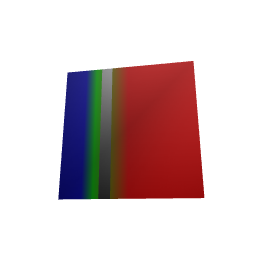

# Bounded JavaFX fragment rendering

JavaFX now has an explicit geometric fallback for scalar interpolation and mixed
layers. `JavaFxSurfaceBackend.createApproximate` opts into it; `create` retains
the existing renderer and rejects fragment plans. The fallback implements the
shared mapping, layer order, opacity, blend, and world-lighting semantics with a
checked color approximation. It does not claim exact native pixels at thresholds
or other discontinuities.

```scala
// On the JavaFX Application Thread:
val settings = JavaFxApproximationConfig.make(
  maxChannelError = 1,
  maxTriangles = 1000000,
  maxGeneratedBytes = 256L * 1024 * 1024
).toOption.get
val backend = JavaFxSurfaceBackend.createApproximate(settings).toOption.get
val rendered = backend.render(plan)
```

Errors are returned before replacing the displayed scene when preparation exceeds
a resource, depth, or precision limit. `maxGeneratedBytes` covers generated
primitive/provenance buffers, native mesh buffers, and base-level textures; it
excludes object overhead, temporary construction storage, driver allocations,
and retained input plans. It is not a total-process memory limit.

## How the bound is obtained

The existing partitioner cuts scalar mapping knots, display limits, thresholds,
and split gaps. Within each region, the new evaluator encloses each layer's
channel and alpha ranges. It propagates these intervals through all four blend
modes over the opaque surface base. Lighting uses bounds on the interpolated
world normal, its norm, and its dot product with the declared light direction.

A triangle receives the midpoint of its resulting color interval only when the
largest channel error is within the requested limit. Otherwise it is bisected.
The result retains each accepted interval, original face, vertex IDs, and
barycentric coordinates. Thus acceptance uses interval bounds rather than a few
sampled colors. The bound applies to the partition's one-sided interior display
function; exact endpoint inclusion remains the reference renderer's contract.
Native coverage, antialiasing, and color rounding are measured separately.

Adaptive triangles must meet along identical edges. The implementation propagates
edge splits between neighboring triangles and incident scientific faces. Original
edge cuts are calculated in a canonical vertex order. A regression checks that
every interior edge has two incident triangles, including the scientific mesh's
shared diagonal. Without this step, the native experiment produced isolated
background-colored cracks despite correct color intervals.

The native adapter uses constant swatch-center UVs, so each triangle has zero
texture-coordinate derivatives. Texture filtering cannot blend its color with
another face's swatch. Large results use chunk-local point and normal buffers,
avoiding duplication of the entire derived mesh in every texture chunk.

## Integration contracts

- Plan revision 7 carries original positions and constant-partition provenance.
  Scientific meshes and scene document revision 5 remain unchanged.
- The opt-in capability ID is `javafx-scene3d-bounded-v1`. Its capability report
  declares the approximation; it is distinct from `javafx-scene3d`.
- Camera and layout changes reuse the prepared geometry. Receipts record reuse,
  preparation time, total render time, face counts, error bounds, and buffer costs.
- Data, threshold, lighting, and morph changes may rebuild derived topology.
  Callers can record these as `SurfaceAdmissionPath.DerivedGeometryUpdate`.
  Ordinary style/timepoint admission still rejects geometry uploads.
- Native upload observations count actual chunk buffers, texture coordinates,
  face tuples, and submitted chunk draws.
- Controller picks use the displayed partition to recover original scientific
  faces, vertices, and barycentric coordinates, including after morph updates.
- Network attachment retains the original sample positions, normals, colors,
  and raw scalars. Explicit original-face coverage prevents scientific mapping
  colors, including opaque invalid colors, from painting appended network faces.
  Network layers cover only their own appended faces; repeated attachments retain
  earlier coverage. Legacy scenes avoid allocating unused original-sample buffers.
- Preparation failure preserves mounted resources. Disposal clears the backend's
  resource ownership and detaches scene listeners.

## Native evidence and cost

The test spans two independently varying scalar layers, opacity 0.7, a hidden
band, and optional varying-normal lighting. It checks 64-, 128-, and 256-pixel
views, orthographic and oblique perspective cameras, and antialiasing on/off.
All 24 configurations meet the two-byte native interior budget outside a
predeclared two-pixel band around mapping boundaries. Full interior errors are
retained; no budget was loosened to admit a case.

The strict one-byte geometric bound is expensive for this steep two-face fixture:
about 240,000–331,000 derived faces and 95–130 MB of counted generated buffers
and textures. Initial preparation takes seconds, while camera changes reuse it.
These are fixture measurements, not cortical-scale performance evidence.
The eight-byte update fixture exercises multiple 64-pixel texture chunks,
timepoint and threshold changes, a true white-to-pial morph, original picks,
resource-limit failure, and disposal.

The final native run passes all 24 cases, update/pick checks, disposal, and a
full-image comparison before and after a rejected update. It exits successfully
without the earlier asynchronous shutdown exception. Six additional network cases
cover scalar-only, face/scalar, and nearest/scalar scenes with lighting on/off.
Each checks 5,864 pixels including 752 network pixels; the largest channel error
is zero unlit and one lit. The geometric error budget for these cases is two.

JavaFX tests run in a forked JVM. Recompilation in a long-lived sbt session had
attempted to load the same native library through a replacement classloader;
isolating the test process removes that repeat-run failure.
The final `surfaceViewConformance` run passes all 540 tests across its ten
JVM/Scala.js project targets. Native framebuffer checks remain separate evidence.



The [receipt](../benchmarks/receipts/surface-bounded-javafx-2026-09-07.json)
contains exact cases, construction/update costs, test counts, and source/artifact
hashes. Earlier failed texture experiments remain recorded in
[surface-partition-review.md](surface-partition-review.md).

## Remaining full-plan work

Run cortical-scale and categorical native comparisons and complete
publication-scale acceptance. Implement Three.js
scalar/layer shaders, upstream legend drawing and automatic mapping-derived
legends, scene/publication identity checks, and final visual/publication gates.
The pre-existing example checksum discrepancy still needs independent resolution.
This implementation does not close the full surface-map plan.
