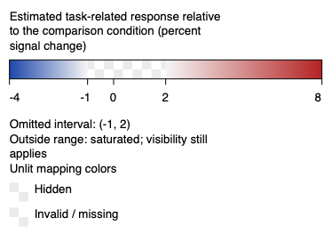
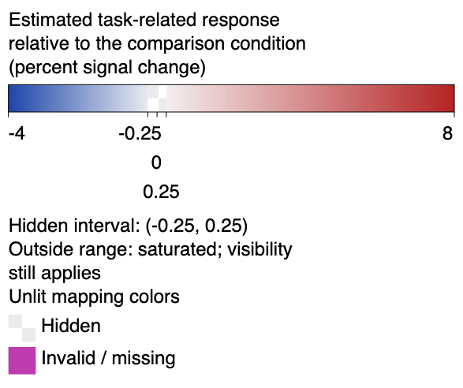

# Mapping-derived legend foundation

The isolated Intaglio implementation now provides `ScalarLegend`,
`LegendTitle`, and `ScalarLegendDrawing`. A legend retains the effective
`ScalarMapping`; its limits and colors cannot be edited independently. Quantity,
units, ticks, hidden/invalid keys, threshold intervals, split gaps, and
out-of-range policy contribute to its inspectable description. Its versioned
identity includes the mapping and metadata, while layout and font changes leave
that identity unchanged.

Ticks use the full scalar window's normalized coordinate. Asymmetric diverging
and split scales preserve their physical proportions; colors use each segment's
own normalization. The drawing wraps titles and places colliding tick labels on
separate rows. It reports physical dimensions and tick bounds so a publication
layout can reserve space before drawing the surface.

Color strips split at mapping boundaries and use sampled images with
nearest-neighbor rendering. This avoids the stripes introduced by independently
antialiasing adjacent narrow rectangles. Each stored pixel is an exact evaluation
at its sample; the finite resolution remains a display approximation. Chromium
honors the exported SVG image-rendering hint. CairoSVG does not, so its initial
blurred conversions were replaced with browser screenshots for acceptance.

The upstream core and SVG suites pass 519 tests across JVM and Scala.js.
New regressions use an independent piecewise color oracle, analytic tick
coordinates, exact stored strip pixels, invalid inputs, narrow high-offset
labels, and nonoverlapping measured tick bounds. Eight SVGs cover sequential,
asymmetric diverging, split, and threshold/missing mappings at two typography
sizes. The native browser found no overflowing or overlapping text in any case.
Portable font metrics remain estimates; callers can supply platform metrics.

This is not completion of Stage 4. The upstream implementation is published on
the existing scalar-mapping branch at immutable commit
`1d27871cbdeb16d4c43d5d1d6f42b984b4a8ee61`. Its changes are preserved in a
[replayable source patch](../benchmarks/receipts/intaglio-scalar-legends.patch).
The [receipt](../benchmarks/receipts/surface-legend-foundation-2026-09-07.json)
records the earlier foundation's exact source/artifact hashes and test/browser
output. All six published source files match that tested receipt.

ScalaFIM now provides typed continuous, split, categorical, and manual requests.
`SurfaceLegend.bind` resolves automatic requests from current layer presentations;
shared requests require identical effective mappings, including hidden/invalid
colors and categorical fallback colors. Categorical legends require complete
palette labels and nearest-sample or face-constant interpolation. Opaque,
hidden, or undisplayed sources are rejected. Scalar coordinates and bar sampling
delegate to Intaglio; the geometric partitioner also uses Intaglio's mapping
boundaries rather than maintaining a second implementation.

Scene revision 6 persists requests and effective legend identities. Restoring
a scene rebinds its legends after restoring presentation overrides and rejects
stale identities. Camera and opacity changes leave calibration identity intact.
Older scene revisions retain their JSON shape; legacy publication swatches
retain their output. The [binding receipt](../benchmarks/receipts/surface-legend-binding-2026-09-07.json)
records the consumer checks and source snapshot.
The focused consumer suites pass 242 tests (121 on JVM and 121 on Scala.js),
including 15 new legend and scene contracts on each platform, without compiler
warnings. These runs use the default remote dependency pin, not a local override.

The subsequent [publication integration](surface-publication-legend-review.md)
adds measured placement, wrapped categorical/manual drawing, and native SVG
acceptance. ScalaFIM now pins that extension at `55658ab`; its upstream suites
pass 527 tests and the focused consumer suites pass 252 tests. The cortical and
final example/native gates remain open in the [completion audit](surface-map-completion.md).
