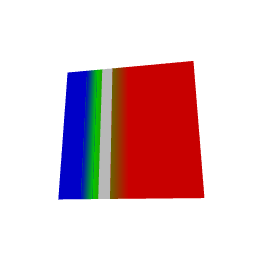
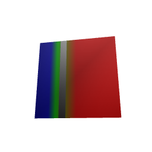

# Boundary partitioning for native scalar maps

The scalar JavaFX experiment now passes its interior color budget when each
partition region has an isolated texture. This is prototype evidence, not
production backend admission. Native scalar rendering still rejects through the
public backend until resource management, updates, and picking are integrated.

## Shared geometry and evaluation

`SurfaceMappingPartition` cuts original-triangle barycentric space at scalar
ramp knots, display limits, visibility endpoints, and split boundaries. Cuts from
multiple layers intersect. Existing nearest-vertex subdivisions retain original
face and vertex IDs after additional cuts. Nonfinite scalar faces retain their
constant invalid interior. Construction requires explicit triangle and per-face
cut budgets and fails with a typed error before growing past those budgets.

The tests use analytic area identities: a threshold band in the coordinate field
`f = 1 + 3*x` occupies 1/12 of the square; two independent bands intersect over
1/144. They also check face coverage, positive orientation, noncrossing mapping
boundaries, nearest-region ownership, finite extreme domains, and budget failures.

`SurfaceFragmentEvaluator.within` extends the interior branch of a partition
region to its texture boundary. This prevents an included threshold endpoint or
a finite corner of an invalid face from coloring the adjacent open region.
The reference evaluator continues to honor exact endpoint and zero-weight rules.

## Scalar native experiment

The experiment uses the actual JavaFX framebuffer at 64, 128, and 256 pixels,
orthographic and oblique perspective cameras, antialiasing on and off, and
32-, 128-, and 512-texel strips. There are 108 cases and 1,089,144 original-face
interior samples. A second metric excludes a two-pixel band around mapping
boundaries, estimated using the local scalar gradient; it covers 997,230 samples.
The predeclared budget for that second metric is two 8-bit channel values.

| Texture arrangement | Affine passes | Piecewise passes | Threshold passes |
| --- | ---: | ---: | ---: |
| Four-row strips packed together | 36/36 | 8/36 | 2/36 |
| Separate texture per derived triangle | 36/36 | 36/36 | 36/36 |

All isolated-strip cases have maximum error at most 2 outside the boundary band.
Full interior maxima are 2, 100, and 184 for affine, piecewise, and threshold
maps respectively. Those boundary errors are retained in the receipt; this is
not evidence of exact per-pixel equivalence or exact endpoint rasterization.
The packed-versus-isolated comparison supports inter-region texture filtering
as a cause of the packed texture failure. It does not establish the precise
JavaFX filtering kernel.

The two scientific triangles become 2, 14, or 22 derived triangles, depending
on the mapping. Isolated strips consume 1,024 to 180,224 base-level RGBA bytes
for this fixture. Those numbers exclude native object overhead and driver
allocations. A mesh and texture per triangle is an experiment, not a scalable
cortical renderer; grouping equivalent regions remains necessary.

## General composition experiment

A second fixture uses an independently varying grayscale curvature underlay,
a thresholded scalar overlay at opacity 0.7, and optionally varying normals
with the declared world-space lighting. Square barycentric textures passed only
2/36 cases in each lighting mode. Increasing tile resolution worsened errors in
narrow triangles. Orthogonal world-space texture axes with equal texel density improved the
result. Smooth field extrapolation into padding improved the passing-case count
further, but neither configuration meets the full budget:

| Layered texture method | Cases within budget | Worst interior error outside the boundary band |
| --- | ---: | ---: |
| Square barycentric tiles | 4/72 | 35 |
| World-space tiles, clamped padding | 39/72 | 21 |
| World-space tiles, extrapolated padding | 43/72 | 25 |

The last method has more passing cases but a worse maximum than clamped padding;
this is not monotonic improvement. At maximum dimension 64 it passes 8/12 unlit
and 9/12 lit cases. Some perspective antialiased 128-pixel views still have
errors of 11 and 8 respectively. The next experiment should test field-coordinate
two-axis textures and filtering-aware region grouping instead of admitting the
current general atlas path. No error budget was relaxed to count a case as passing.

Both images were inspected. Their appearance does not override failed numerical
checks. The 22-triangle layered fixture used 8,512, 25,600, or 87,552 base-level
RGBA bytes for maximum tile dimensions 16, 32, and 64 respectively.

## Verification and lifecycle

The final shared/reference regression run passed 97 surface-view tests and 26
raster tests on each platform (246 total). The final native runs completed and
wrote all measurements. The combined native log also contains a macOS JavaFX
`InvokeLaterDispatcher` exception, `Main Java thread is detached`, during
shutdown despite exit status zero. Clean native shutdown is therefore still
unverified; explicit `Platform.setImplicitExit(false)` alone did not resolve it.

The [receipt](../benchmarks/receipts/surface-partition-2026-09-07.json) includes
all cases, source and image hashes, baseline comparisons, and exact test counts.
The [compressed logs](../benchmarks/receipts/surface-partition-2026-09-07.log.gz)
retain failures and shutdown diagnostics as well as successful measurements.

## Remaining acceptance

Complete native layer/lighting sampling, group textures and geometry under
explicit allocation limits, integrate original-coordinate picks, verify morph
and mapping update costs, and test cortical-scale scenes. Three.js scalar
shaders, automatic legends/publication integration, the existing example
checksum discrepancy, and the final full-plan gates remain open.
