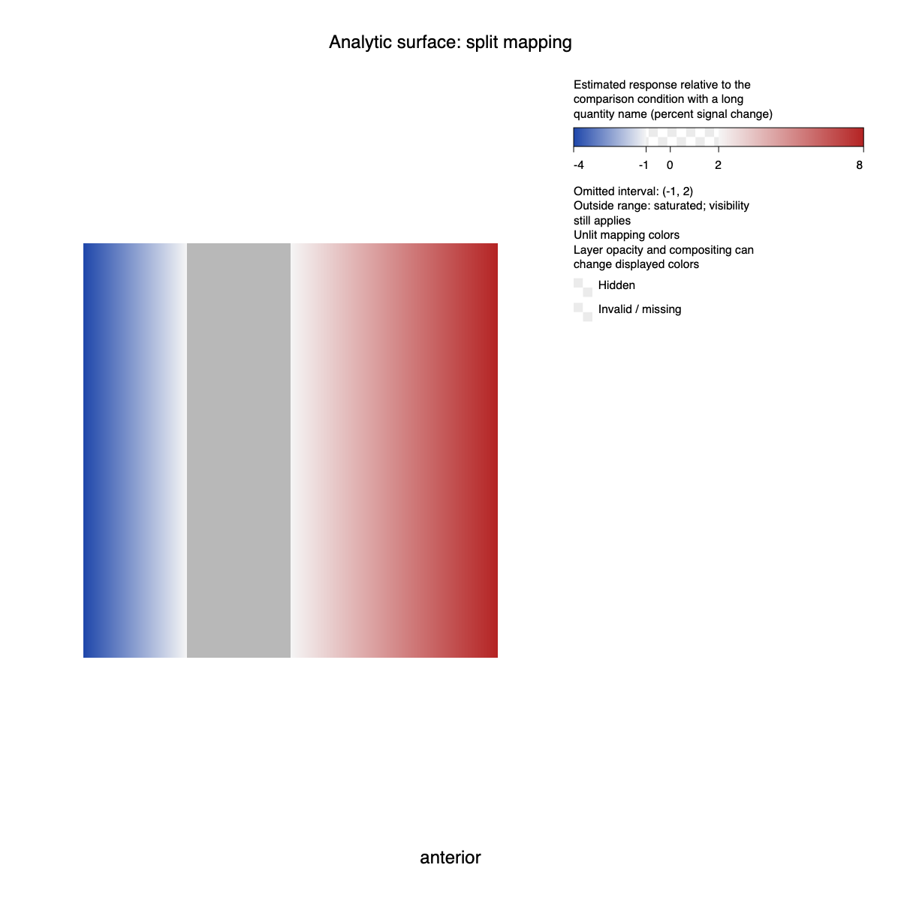
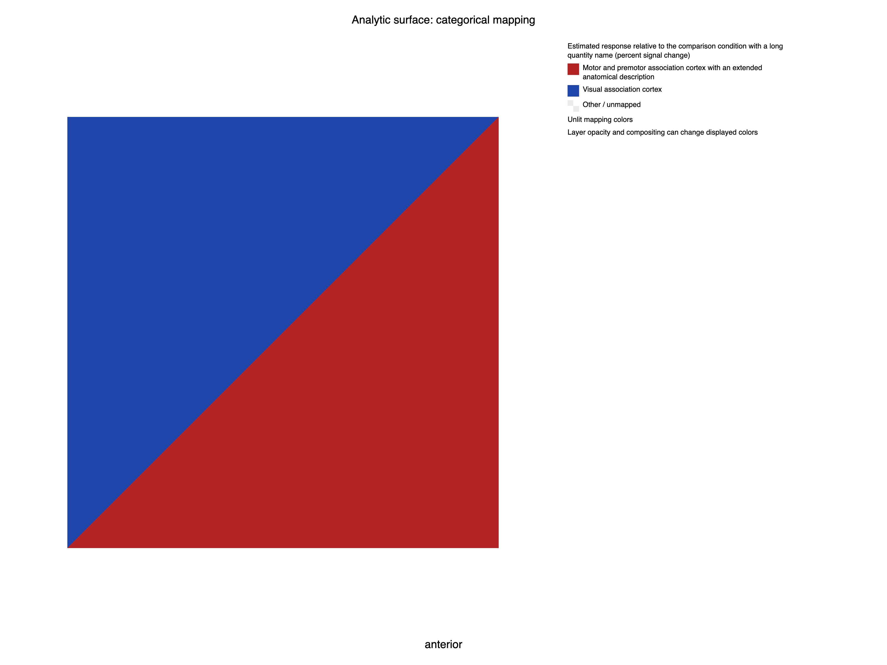
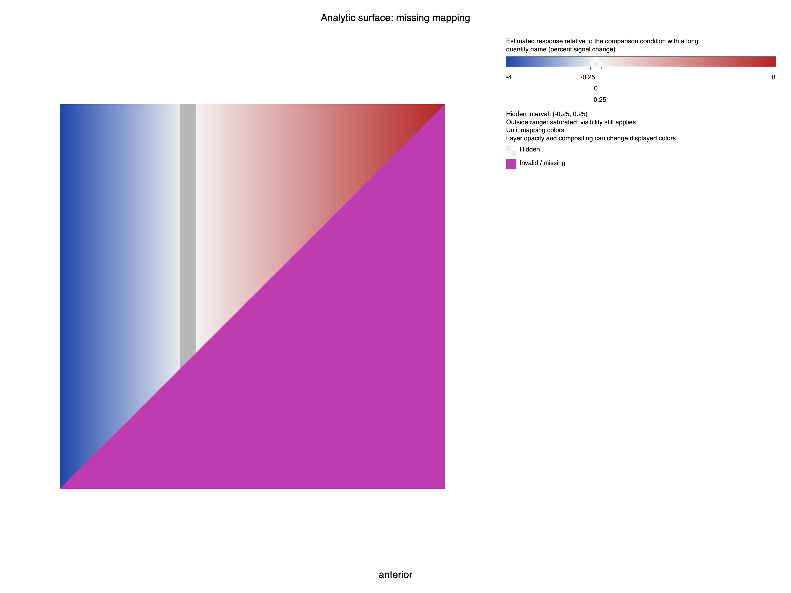

# Surface publication legends

`SurfaceLegendPublication.prepare` binds legend requests to the current layer
presentations and reserves a measured column beside the surface. The renderer
receives the prepared plan, exact surface image dimensions, and background.
The resulting artifact combines that image with Intaglio chrome and records
surface resource keys, camera/timepoint, legend identities, original layer
interpolation policies, and physical frames. Wrong-sized images and overflowing
legend stacks return typed errors. Empty legend lists release the column.

The original `SurfacePublication.decorate` API and its manual swatch output are
unchanged. Legacy swatches passed through the new preparation API become an
explicit manual card. A renderer callback remains responsible for honoring its
inputs; receipt identity does not independently certify arbitrary callback pixels.

Generic wrapping and swatch drawing live in Intaglio, published and pinned at
`55658abfbbfed0c9a36ab612b38bd8f0677bc158`. Its core/SVG suites pass 527 tests
across JVM and Scala.js. ScalaFIM's focused surface-view suites pass 252 tests
(126 per platform), including layout separation, image-size rejection, renderer
error propagation, source identities, updated mappings, and camera invariance.
The full surface conformance matrix also passes all 588 tests across 10 targets
with this immutable dependency pin.

The gallery uses an analytic two-triangle surface to isolate mapping and layout.
It covers continuous, asymmetric diverging, split, threshold/missing, categorical,
and manual legends at 1200×1200 manuscript and 3200×2400 poster sizes. Chromium
151.0.7922.34 found no overflowing or overlapping text in any of the 12 SVGs.
Eight opaque categorical/manual swatches match their native screenshot RGB
values exactly. Each mapping family was also reviewed visually. Browser, server,
temporary tooling, and the owned profile were closed and removed afterwards.







Reproduce the SVGs with:

```sh
sbt 'surfaceViewExamplesJVM/Test/runMain scalafim.examples.surfaceview.SurfaceLegendPublicationGallery target/surface-publication-legends'
```

The [receipt](../benchmarks/receipts/surface-publication-legends-2026-09-07.json)
records source hashes, test logs, browser bounds, exact swatch checks, and artifact
hashes. The forked gallery on JDK 25 prints Scala 3.7.4's `sun.misc.Unsafe`
deprecation notice; it exits successfully, and the compiler emits no warnings.

Scalar bars retain the documented finite 512-sample nearest-neighbor display
approximation, partitioned at mapping boundaries. Default font metrics remain
estimates, with an explicit platform-metrics override. These checks prove
publication composition of reference-raster images and native SVG output;
the real cortical plate, native 3D performance checks, and final example gates
remain separate requirements in the [completion audit](surface-map-completion.md).
