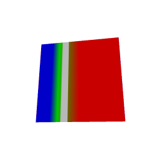

# Scalar interpolation and JavaFX lookup feasibility

The portable raster now interpolates raw vertex samples before applying an
Intaglio mapping. This implements the next part of Stage 2 for one unlit scalar
layer per surface. JavaFX lookup textures are explored in a separate native
probe; production JavaFX and Three.js scalar-fragment support remains pending.

## Supported reference path

Use `SurfaceLayer.interpolatedScalar(id, surfaceId, geometry, values, mapping)`.
Its mapping argument is typed as `ScalarMapping`, so opaque color callbacks and
categorical interpolation flags cannot accidentally select this mode.

The compiler retains owned `Double` samples and an effective mapping after
presentation overrides. The raster carries original-triangle barycentric
coordinates through world/frustum clipping, perspective-corrects them at the
pixel, interpolates the samples, evaluates the mapping, and then applies layer
opacity/blending over the base surface. Limits are applied after interpolation.
Hidden fragments reveal that base. Additional layers on the same surface,
including hidden layers, and directional lighting are rejected before packing.

Nonfinite samples invalidate locations where they contribute. Exact zero-weight
samples are ignored; the remaining weights are not renormalized to rescue an
invalid interior. Constant fields remain exact, including extreme finite values.
A direct weighted sum preserves cancellation residuals; scaled fallback handles
finite inputs whose intermediate sum overflows.

Raw samples affect resource identity even when all vertex preview colors are
unchanged. Profiles include the additional eight bytes per sample. Original
geometry and scientific pick identities are unchanged. Readouts retain their
existing nearest-vertex sample meaning.

Scene and plan revision 5 record scalar interpolation. Revisions 1–4 remain
readable, and scene admission infers `ScalarInterpolation`. The production native
adapters reject these plans before mesh/texture uploads rather than consuming
the vertex preview colors as though they represented scalar interpolation.

## Independent checks

The raster tests use the coordinate field `f(x,y,z) = 1 + 3*x`. A manually
specified projection uses `w = 1 + x/2`; the test independently recovers world
coordinates from screen coordinates and evaluates a tabulated piecewise palette.
It does not use the raster's picks to calculate expected colors. Checks cover
orthographic and perspective views, clipping, saturation, nonlinear ramps,
thresholds, split scales, opacity, and invalid interiors. Picks are checked
separately against those analytic coordinates.

The shared tests also cover extreme constants/cancellation, vertex permutation,
affine unit changes, owned samples, resource identity, byte accounting,
unsupported composition, and scene migration. Backend-specific tests establish
explicit rejection before a scalar shader/texture lowering is admitted.

## JavaFX experiment

`JavaFxSurfaceScalarProbe` uses the ordinary backend only to set up a mesh and
camera. It then replaces the mesh UVs and material with an explicitly experimental
lookup texture. Scalars are encoded affinely across the full data envelope
[-2,4], without clamping vertices to display limits [-1,1]. The texture includes
the mapped base-surface composite, so this is an opaque, single-layer experiment.

The matrix covers texture widths 256/1024/4096, snapshot sizes 128/256,
orthographic/oblique perspective views, affine/piecewise/thresholded mappings, and
antialiasing enabled/disabled. The predeclared accuracy budget is two 8-bit
channel values away from discontinuities, with at least 1,000 checked pixels.
The probe also reports maximum error across all checked triangle interiors and
the number of pixels exceeding the budget. Threshold exclusions span two scalar
texel intervals; they do not remove the whole-image error from the record.

The first run completed its measurements but exposed a startup/shutdown ordering
bug in the probe. Work now runs through `Platform.runLater` after toolkit startup,
so shutdown occurs after initialization has finished. Its final process status
and the full matrix are recorded in the receipt.

## Measured outcome

The final native run exited successfully and checked 1,036,494 triangle-interior
pixels across 72 cases. Each mapping family has 24 cases. Errors below are
absolute 8-bit channel differences from the scalar raster reference.

| Mapping | Cases meeting the away-from-threshold budget | Maximum interior error | Maximum error after threshold exclusion |
| --- | ---: | ---: | ---: |
| Affine grayscale over the full data range | 24/24 | 2 | 2 |
| Piecewise ramp with saturation | 6/24 | 13 | 13 |
| Piecewise ramp with an open hidden band | 2/24 | 108 | 98 |

The affine calibration supports the scalar-coordinate approach for this fixture,
including its perspective views. The piecewise/threshold results do not meet the
admission budget. Increasing texture resolution and changing the antialiasing
setting did not resolve these failures. Filtering around mapping changes is a
candidate explanation; these measurements do not uniquely identify every
pipeline contribution.

The image shows the 4096-texel, 256-pixel perspective case with antialiasing
requested. Its gray band represents hidden values over the base surface.
The image was visually inspected, but numerical checks determine admission.

The next JavaFX experiment should partition triangles at ramp knots, display
limits, and threshold boundaries, giving adjacent regions separate padded
texture domains. That experiment must measure both color error and the derived
geometry/upload cost before becoming a production capability.

## Evidence and remaining work

All **491 surface conformance tests passed**, including 88 viewer tests and
21 raster tests on each platform. The example suites retain only the known
checksum failure: JVM 11/12 and Scala.js 10/11 pass, expected `895258625`,
obtained `-748488703`. No golden image was changed.

The [validation receipt](../benchmarks/receipts/surface-scalar-fragments-2026-09-07.json)
contains source hashes, commands, test outcomes, native measurements, and archived
logs. The [scoped patch](../patches/scalafim-scalar-fragments.patch) is relative to
the pre-phase dirty working tree and has already been applied locally. No new
provider revision is needed; Intaglio remains pinned to
`c6b55d066a8f4c27b0acc3c34fc04737bfaba0bd`.

Production native scalar paths, geometric threshold splitting, general layered
composition, lighting, and automatic legends are not implemented by this slice.
The existing vertex-only GIFTI example checksum failure remains a separate
acceptance issue; its expected image is not changed here.
