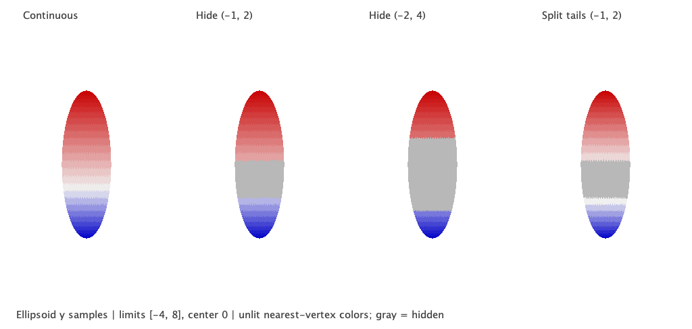

# Inspectable scalar mappings

Surface scalar layers now carry an inspectable mapping from Intaglio. A renderer
can read the scale, ramp stops, visibility interval, endpoint rules, and missing
value policy from the same object that supplies sample colors. This is the
mapping foundation needed before scalar interpolation and automatic legends.

Intaglio commit [`c6b55d066a8f4c27b0acc3c34fc04737bfaba0bd`](https://github.com/canardlapin/intaglio/commit/c6b55d066a8f4c27b0acc3c34fc04737bfaba0bd)
is published on `codex/scalar-mapping-descriptors-20260907` and pinned in
ScalaFIM's `build.sbt`. The provider branch starts at the previous consumer pin,
`596b398af380079e4b251535230d0bc03cd88c51`, to avoid bundling later upstream
changes. It is not merged into Intaglio main. ScalaFIM's integration is local
working-tree code; unrelated existing changes were preserved.

## Mapping behavior

- Sequential scales use one ramp. Continuous diverging scales give each side
  of an explicit center a ramp with a shared center color. Split scales assign
  ramps to two visible tails and omit the open interval between them.
- Visibility can select inside or outside a separate interval, with lower,
  upper, both, or neither endpoint included. It does not change normalization.
  The legacy transparent band still hides only its open interior.
- Nonfinite, hidden, and clamped samples have distinct result states even when
  their colors are identical. Classification checks nonfinite values first,
  then visibility on the original value, out-of-range behavior, and scale gaps.
- Piecewise ramps interpolate stored sRGB bytes, including alpha, with nearest
  integer rounding. Finite display windows whose width overflows now normalize
  correctly in both the old and new APIs.
- `canonicalKey` describes the complete mapping with versioned IEEE-754 number
  encodings and canonical signed zero. It is an identity string, not a hash or
  standalone serialization format.

The [provider guide](https://github.com/canardlapin/intaglio/blob/c6b55d066a8f4c27b0acc3c34fc04737bfaba0bd/docs/scalar-mappings.md)
contains a split-scale example and the evaluation contract.

## Viewer integration

Pass `mapping.colorizer` to `SurfaceLayer.scalar` or `faceScalar`.
`layer.scalarMapping` exposes the base descriptor and
`layer.effectiveScalarMapping(presentation)` resolves window/threshold overrides.
Window changes preserve absolute center and split cutoffs; invalid windows fail
in the reducer and compiler, including when a layer is hidden.

Compiled packets carry the effective mapping, and layer resource keys include
its identity even when current samples happen to produce unchanged colors.
Camera and opacity changes preserve the unlit descriptor. Arbitrary colorizers
remain usable for sample coloring, with no invented mapping metadata or
adjustment capabilities.

Scene and plan revisions are now 4. Scene restoration checks the base mapping
identity against the supplied model and then replays presentation overrides.
Scene revisions 1–3 remain readable. Mapping definitions and payload arrays
remain external; revision 4 does not introduce a standalone mapping codec.

## Visual comparison

The ellipsoid has 1,742 vertices and 3,480 faces, with scalar values taken from
its vertical coordinate. All panes use limits [-4, 8], center 0, the same
geometry/camera, and unlit nearest-vertex sample colors. Gray is the hidden
underlay. The two visibility-only panes retain the original normalization;
the split pane redistributes the ramps across [-4, -1] and [2, 8].

This is a conceptual comparison inspired by the surface-map plan, not numerical
parity with the article's scripts or palettes. Small triangle boundaries reflect
nearest-vertex sampling. The plate does not demonstrate scalar interpolation
inside triangles or native JavaFX lookup textures.

## Verification

The [machine-readable receipt](../benchmarks/receipts/surface-scalar-mapping-2026-09-07.json)
records exact source and artifact hashes, commands, and test results.

- Intaglio core: 233 JVM tests and 229 Scala.js tests passed. New cases cover
  independent tabulated colors, asymmetric scales, immediate boundary neighbors,
  invalid constructors, overflow, identity, legacy compatibility, and affine
  changes of scalar units.
- Surface conformance: 467 tests passed in both the isolated consumer build
  and the actual checkout against the published pin, without a local Intaglio
  override for the final run.
- The viewer suites pass 81 tests per platform, including face/vertex parity,
  invalid hidden-state rejection, mapping identity, and scene migration.
- Example suites retain the previously reproduced checksum failure on both
  platforms: expected `895258625`, obtained `-748488703`; JVM 11/12 pass and
  Scala.js 10/11 pass. The golden value is unchanged. Broad example acceptance
  is therefore not green.
- The rendered plate was inspected for label clipping, shared orientation,
  hidden intervals, and tail-color redistribution. Native scalar-fragment
  admission and hosted CI are not claimed by these local results.

The [provider patch](../patches/intaglio-scalar-mapping.patch) is relative to the
previous Intaglio pin. The [consumer patch](../patches/scalafim-scalar-mapping.patch)
contains only this phase's source/test changes and dependency-pin update, relative
to the pre-phase dirty working tree. It is retained as a review artifact and has
already been applied; it is not a patch against clean ScalaFIM HEAD.

Next: scalar fragment evaluation in the portable reference, followed by the
JavaFX lookup-texture and threshold-partition feasibility probes. Automatic
legends remain Stage 4. General fragment composition is also still pending.
