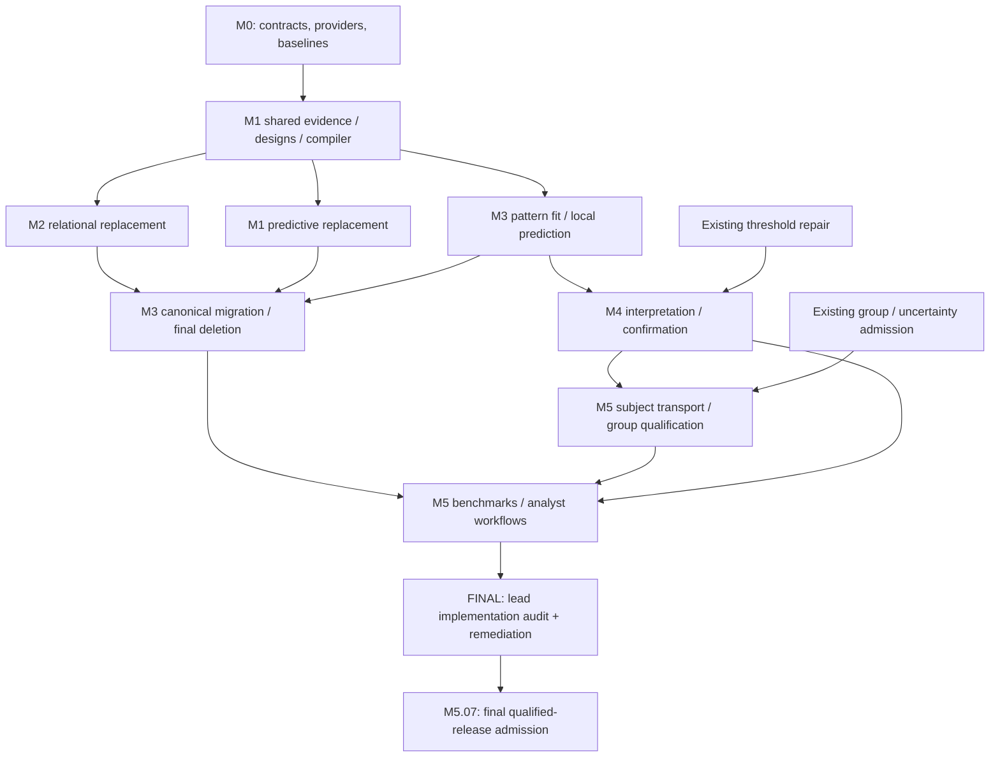

# Unified MVPA implementation epic

Planning record: 2026-09-12. This document indexes live Mote work; it is not an implementation or qualification report.

Epic: **bd-01M2BMGRP4MSM0RRRKNTHM0H4K** — Unified MVPA, relational geometry, and pattern-first whole-brain analysis.

Primary label: `unified-mvpa`. The live store is this checkout’s local `.mote`; this filing is not a GitHub issue or release publication.

Authority: [PRD v0.2](unified-mvpa-prd.md), [scientific notes](unified-pattern-first-mvpa-notes.md), [architecture notes](unified-mvpa-architecture-notes.md), and [supplementary review](unified-mvpa-supplementary-review.md). Where they conflict, the PRD's rapid replacement policy and explicit qualification boundaries govern.

M0 migration authority: [ownership constitution and source-bound migration ledger](unified-mvpa-migration-ledger.md).

M0 inference authority: [frozen inference and known-truth calibration protocol](unified-mvpa-inference-calibration-protocol.md).

M0 resource authority: [frozen resource and comparative benchmark protocol](unified-mvpa-resource-comparative-protocol.md).

Planning source reference: `e071e83b3a23bc6f304b1e72625d6281d9cfc9ba`, plus the identified design documents in the working tree. The checkout contains unrelated concurrent changes; this reference is not a clean-tree claim or provider admission. Each owner refreshes relevant sources and pins when claiming a packet.

## Delivery contract

Build one foundation around identified evidence, distinct evidence designs, composable measurement legs and open typed estimands. Predictive fitting and relational geometry share that foundation without pretending to have identical statistical semantics. The flagship global fit learns sparse, spatially coherent forward patterns and derives classification, multivariate encoding/decoding and restricted-measurement prediction from a covariance-aware model.

Interpretation distinguishes forward patterns, decoder filters, empirical Haufe diagnostics and conditional predictive information. Discovery-frozen rotations, voxel/component/rank confirmation and commensurate group analysis acquire claims only through their own qualification gates.

The foundation must demonstrate three genuinely different vertical slices: keyed leave-one-run-out Swift centroid; operator-native RDM/crossnobis/RSA with explicit metric and pairing; and whole-brain structured pattern fitting with a derived ROI predictor. The last one is not a singleton ROI analysis.

Migrate callers and delete replaced orchestration in the same delivery slice. No new legacy enum cases, permanent compatibility façade or `legacy/` source tree. Shared old machinery and temporary private bridges are gone by M3. Preserve useful kernels, fixtures, ROI/searchlight functionality and the separate response/read module.

## Live hierarchy and dependency semantics

- 1 epic; 6 milestone acceptance gates; **64 granular work tickets**: 61 new and 3 reused existing MVPA packets (including the subsequently requested lead implementation audit).
- 3 additional existing group/uncertainty/threshold prerequisites retain their original ownership and hierarchy.
- 214 planned native `blocks` edges encode prerequisites; native `parent` relations encode non-blocking containment.
- At filing, every new implementation/gate ticket is open and unassigned. The planning-only ticket `bd-01M2BMJ9JEMNF45HA66R0Y290S` records this filing; its completion is not implementation progress.
- All 31 numbered PRD requirements are mapped to work packets below. Task bodies contain objective, inputs, owning seams, scope limits, acceptance, verification commands and handoff evidence.

For `mote dep add CHILD PARENT`, CHILD is blocked by PARENT. Milestone gates are blocked by their required deliverables; children are never blocked by their own containing gate. The epic explicitly requires M3, M4 and M5 acceptance; earlier gates are transitive prerequisites. Cross-phase tasks start from their specific prerequisites, so M2 need not wait for all M1 implementation and numerical M3 work can overlap relational migration.

Workstream overview (condensed; exact prerequisites are the live edges and tables):



### Milestone gates

| Gate | Mote ID | Required work packets | Exit meaning |
| --- | --- | ---: | --- |
| M0 — Contracts, provider admission, and frozen baselines | `bd-01M2BNCWMV2C8VPM2V9FEMA2KY` | 7 | Contracts, pinned provider consumer spikes, independent baselines and predeclared calibration/budgets accepted. |
| M1 — Identified evidence and predictive replacement | `bd-01M2BNCYYJXVMJXD0FWER0TTD2` | 14 | Identified predictive path, leakage/inspection/frame parity and predictive legacy deletion accepted. |
| M2 — Operator-native relational replacement | `bd-01M2BND19FB3K3WTFAC6PFYYKX` | 9 | Operator-native relation/query reuse, origin/metric laws and relational legacy deletion accepted. |
| M3 — Global pattern fit and legacy-free foundation | `bd-01M2BND3NJET4H78B71XPGHXKZ` | 16 | Three shared-core slices, canonical/global artifacts, operational admission and no remaining legacy ontology. Pattern method remains experimental. |
| M4 — Interpretation and independently qualified confirmation | `bd-01M2BND5XJFB2P38PT37VDC0AZ` | 10 | Interpretation invariance, scoped voxel/component/higher-rank calibration and measured fast-confirmation claims accepted. |
| M5 — Group analysis and scientific release qualification | `bd-01M2BND856V2GTEYWN1Z186MA6` | 8 | Commensurate group uncertainty, scientific/performance qualification, usable examples, lead implementation audit and final JVM/JS evidence accepted. |

## Work packets

Keys are stable cross-references, not a second issue-ID system. Use the Mote ID to claim, inspect or update work. `M1.E1`, `M1.E2` and `M3.E1` reuse existing issues; their original bodies/history and historical parents remain intact, with an additional integration note and milestone relation. `X-*` references are existing prerequisites outside the new containment tree.

Dependencies in each row are immediate prerequisites. A milestone key alone means that acceptance gate must close. No prerequisites means the packet is on the initial ready frontier, subject to ordinary Mote claim/path checks.

### M0 — Contracts, provider admission, and frozen baselines

| Packet | Mote ID | Deliverable | Prerequisites |
| --- | --- | --- | --- |
| M0.01 | `bd-01M2BNE82Q1NJADVWB3ECXRXWD` | Freeze the ownership constitution and complete the consumer/deletion inventory | None |
| M0.02 | `bd-01M2BNEA7C953AXD5FJ8YDNW9R` | Admit immutable provider capabilities through a cross-platform integration spike | M0.01 |
| M0.03 | `bd-01M2BNEC4NBXSN193PFS0Q5BCR` | Prototype identified runtime axes, repeated occurrences, and bounded inspection | M0.02 |
| M0.04 | `bd-01M2BNEE0WP2AMSQYF5D14G45Y` | Freeze independent migration parity fixtures and baseline conventions | M0.01 |
| M0.05 | `bd-01M2BNEGA9DJWA4DEQKD88BH11` | Freeze the inference and known-truth calibration protocol | M0.01 |
| M0.06 | `bd-01M2BNEJ8CKW74BS0SM5QXQNRE` | Freeze matched resource and comparative benchmark protocols | M0.01 |
| M0.07 | `bd-01M2BNEMJA93MK6VBBKTE7A8VJ` | Independently review and accept the foundation contracts | M0.02, M0.03, M0.04, M0.05, M0.06 |

### M1 — Identified evidence and predictive replacement

| Packet | Mote ID | Deliverable | Prerequisites |
| --- | --- | --- | --- |
| M1.01 | `bd-01M2BNEPV2TD9CXT3HDQG6DTKY` | Implement identified evidence, axis-bound columns, and multiresponse targets | M0 |
| M1.02 | `bd-01M2BNERS3BQVEZZNNJ6JTJWW3` | Implement lawful axis-bound restriction and resampling legs | M1.01 |
| M1.03 | `bd-01M2BNETNF8TD1NQDTW692WE9S` | Implement measurement legs, lazy frames, and spatial scattering adapters | M1.01 |
| M1.04 | `bd-01M2BNEWJMN7SYF95W45SVM6X6` | Implement open estimands, typed results, and inspectable scientific compilation | M1.01 |
| M1.05 | `bd-01M2BNEYF9CDFHNYWN3XDN3MWR` | Implement bounded describe, inspect, explain, and plan-diff diagnostics | M1.04 |
| M1.06 | `bd-01M2BNF0B4H5QTZMX9SCCQSEEJ` | Integrate Alder matrix-native data, fitted artifacts, and scoped preparation | M1.02, M1.04 |
| M1.07 | `bd-01M2BNF274WA3QSW8B4SSRVVGG` | Migrate Swift centroid to keyed leave-one-run-out prediction | M1.03, M1.06, M1.E1 |
| M1.08 | `bd-01M2BNF43FND2B8CY4J4TBBCJN` | Integrate nested tuning, cross-fitting, and scalar/multiresponse regression | M1.06, M1.E1 |
| M1.09 | `bd-01M2BNF6076XXAC7TV776XRV27` | Track read origins, temporal support, and adaptive holdout exposure | M1.05, M1.06 |
| M1.10 | `bd-01M2BNF7YCCH46K478DGXX7KT5` | Migrate remaining predictive heads and cross-decoding consumers | M1.07, M1.08 |
| M1.11 | `bd-01M2BNFAGAZQXBEFDYCBAZ81VZ` | Independently qualify predictive identity, leakage, and frame behavior | M1.07, M1.08, M1.09, M1.10, M1.E2 |
| M1.12 | `bd-01M2BNFCWA46ZY6J17E78G7W9F` | Cut over predictive APIs and delete replaced orchestration immediately | M1.11 |
| M1.E1 | `bd-01M0Z5MJ46C70JQ9NNN4GPMJQQ` | Bind predictive validation to identified sample and run-group evidence **(reused)** | M1.02 |
| M1.E2 | `bd-01M0Z69N65WFHE7DCPVZXG4J9P` | Certify native searchlight neighborhood semantics against PyMVPA **(reused)** | None |

### M2 — Operator-native relational replacement

| Packet | Mote ID | Deliverable | Prerequisites |
| --- | --- | --- | --- |
| M2.01 | `bd-01M2BNFFVZ6WEZW1RS1RQKFEJG` | Build typed partitioned relations and operator-native fMRI evidence adapters | M1.01, M1.02, M1.04 |
| M2.02 | `bd-01M2BNFJAKQGTB91FQ6D4NCMDJ` | Implement ordered pairing and defensible independence/metric claims | M2.01, M1.09 |
| M2.03 | `bd-01M2BNFM8MNBHSAV0MBG18J2NG` | Implement typed first/second-order queries and independent closure oracles | M2.01, M1.03 |
| M2.04 | `bd-01M2BNFP6QZMG5RCK7RGF2Z30W` | Migrate fixed-identity operator RDM with exact baseline semantics | M2.02, M2.03 |
| M2.05 | `bd-01M2BNFRH41EPFJWS0CJYM11B3` | Integrate separately admitted residual-noise normalization | M2.02, M2.03 |
| M2.06 | `bd-01M2BNFTGEMNPJMVQ6EC2H42GG` | Implement dependency-checked query reuse and scoped sufficient-statistic rewrites | M2.03, M2.04, M2.05, M1.05 |
| M2.07 | `bd-01M2BNFWEJFFZYMGJB3Z41RGKP` | Expose RSA, contrasts, and remaining relational consumers over one evidence source | M2.04, M2.05, M2.06 |
| M2.08 | `bd-01M2BNFYS71SHY4RFPJP1DB5MY` | Independently qualify relational laws, origin claims, and query reuse | M2.07 |
| M2.09 | `bd-01M2BNG11Q5NJS0CNXK4GGQ7Y4` | Cut over relational workflows and delete their old wrappers | M2.08 |

### M3 — Global pattern fit and legacy-free foundation

| Packet | Mote ID | Deliverable | Prerequisites |
| --- | --- | --- | --- |
| M3.01 | `bd-01M2BNG3BEBWSAZ3AZ52NSFSEV` | Integrate typed global and canonical decomposition artifacts | M2.03, M2.05 |
| M3.02 | `bd-01M2BNG5AK37QZK08P4VK0966Z` | Define the pattern-first fit artifact and identified target model | M1.04, M1.06, M0.05 |
| M3.03 | `bd-01M2BNG7B6MMAFE8VDM5Q56ZTC` | Implement diagonal-plus-low-rank residual covariance fitting and solves | M3.02, M0.02 |
| M3.04 | `bd-01M2BNG9V3MV63PXSJ4D4QMY8N` | Implement sparse spatial support envelopes with separately controlled signed smoothing | M3.02, M1.03 |
| M3.05 | `bd-01M2BNGC7EZJPA91XSX8CFC25G` | Implement the structured reduced-rank optimizer and convergence evidence | M3.03, M3.04 |
| M3.06 | `bd-01M2BNGEK6DP1GZ3MFQSQARXVK` | Implement shared classification, decoding, and encoding prediction heads | M3.05 |
| M3.07 | `bd-01M2BNGGJM58RH244YCGMGZDVT` | Integrate leakage-safe model selection and evaluated global prediction | M3.06, M1.08, M1.09 |
| M3.08 | `bd-01M2BNGJNQSVJQM863HGBW14W3` | Derive strictly local ROI predictors from the fitted covariance model | M3.06, M1.03, M1.09 |
| M3.09 | `bd-01M2BNGMPD64GHF944S9FKME7S` | Enforce resource admission and explicit budgeted cost probes | M1.05, M3.03, M3.05 |
| M3.10 | `bd-01M2BNGPMWAHEPN4CTC395YFK5` | Integrate deterministic work units, cancellation, and retry-safe reduction | M1.04, M1.03, M1.02 |
| M3.11 | `bd-01M2BNGRSCG831C9RKMKBNACDJ` | Admit durable typed artifact profiles through existing archive/estimate facilities | M1.04, M3.02, M3.10 |
| M3.12 | `bd-01M2BNGTQ54BA008ZQFRMS0CF3` | Independently qualify the whole-brain fit, prediction, and restricted-ROI slice | M3.07, M3.08, M3.09 |
| M3.13 | `bd-01M2BNGX1BYSP54J3P9EYK4N55` | Delete the remaining legacy MVPA ontology and close every migration ledger row | M1, M2, M3.01, M3.12 |
| M3.14 | `bd-01M2BNGZCKC2G6X8ETN0EKE3YD` | Independently audit execution, artifact, and allocation contracts | M3.09, M3.10, M3.11, M3.E1 |
| M3.15 | `bd-01M2BNH1S9YB5QWEG6MR46K7TW` | Accept the legacy-free foundation with three workflows and extension rehearsal | M3.13, M3.14, M3.01 |
| M3.E1 | `bd-01M0Z7JBET61VHWHKSZRJ8HZ7A` | Re-establish and reduce whole-call MVPA allocation on the adopted API **(reused)** | M1.12, M2.09 |

### M4 — Interpretation and independently qualified confirmation

| Packet | Mote ID | Deliverable | Prerequisites |
| --- | --- | --- | --- |
| M4.01 | `bd-01M2BNH46Y3V9H8PY3R8N450MW` | Implement calibrated component filters and distinct Haufe pattern products | M3.06, M1.09 |
| M4.02 | `bd-01M2BNH659B05P8TRTDKCYFS48` | Implement interpretable rotations, oblique coordinates, and stability summaries | M4.01, M3.01 |
| M4.03 | `bd-01M2BNH845EVA9T7ZQ98TYS8C0` | Implement Gaussian conditional-information maps without voxelwise refitting | M3.03, M3.06 |
| M4.04 | `bd-01M2BNHA2YRMAX9N2RBAKBZQ0F` | Implement frozen discovery/confirmation and nuisance-aware inference design | M0.05, M1.09, M3.07 |
| M4.05 | `bd-01M2BNHC2523X7WRDK7G8CNANH` | Implement batched unpenalized voxel-loading confirmation | M4.04, M4.01 |
| M4.06 | `bd-01M2BNHDZT6TN086GDNEA6VK4K` | Implement component association and incremental predictive-value tests | M4.04, M4.02 |
| M4.07 | `bd-01M2BNHG03Y1EV95H0CMQ86NRN` | Implement sequential rank confirmation in independently learned subspaces | M4.04, M0.05 |
| M4.08 | `bd-01M2BNHJ25MD4S4SKXZS6WDP9K` | Integrate lawful randomization, family-complete multiplicity, and null invalidation | M4.05, M4.06, M4.07, M3.10, X-THRESH |
| M4.09 | `bd-01M2BNHMAR9S58QCMT2DEM16VN` | Independently calibrate voxel, component, rank, and adaptive-inference claims | M4.08, M4.02, M4.03 |
| M4.10 | `bd-01M2BNHQ9X2NX6KDS3SE8CK513` | Qualify fast confirmation costs and publish interpretation/inference claim boundaries | M4.09, M3.14 |

### M5 — Group analysis and scientific release qualification

| Packet | Mote ID | Deliverable | Prerequisites |
| --- | --- | --- | --- |
| M5.01 | `bd-01M2BNHSTYKBBD12JS8XXC9X7K` | Implement commensurate subject coordinates and covariance-preserving transport | M4.02, M4.04 |
| M5.02 | `bd-01M2BNHVYX5971WGE1C78K5041` | Bridge subject confirmation uncertainty into the admitted group model | M5.01, M4.05, X-GRPBASE, X-UNC |
| M5.03 | `bd-01M2BNHY1PTWTMYZR1VQYBVRPJ` | Implement group summaries, heterogeneity, and held-out-subject prediction | M5.02, M4.06 |
| M5.04 | `bd-01M2BNJ0J84PCJEC0NDYFVZVRJ` | Independently qualify group uncertainty, heterogeneity, and alignment scope | M5.03, M4.09 |
| M5.05 | `bd-01M2BNJ3PTVV3R047DSCFT9R4J` | Run matched predictive, localization, stability, and end-to-end performance benchmarks | M3.15, M4.10, M0.06 |
| M5.06 | `bd-01M2BNJ64X3C45TMTE4A4AHMMS` | Deliver analyst-facing workflows and independently review native API usability | M3.15, M4.10, M5.03 |
| FINAL | `bd-01M2BQ3BVVGFX593HK27P34W63` | Lead audit and remediation of the delegated implementation | M3, M4, M5.04, M5.05, M5.06 |
| M5.07 | `bd-01M2BNJ83NZBEVM6FVPAXKG227` | Assemble the independent qualified-release evidence and final portability gate | M5.04, M5.05, M5.06, M4, FINAL |

## Existing prerequisites and scope protection

| Reference | Mote ID | Existing work | New consumer |
| --- | --- | --- | --- |
| X-GRPBASE | `bd-01M20TKX7VYFT3BHCM7QAMA6NG` | Recover and requalify the group numerical baseline before further inference admission | M5.02 |
| X-UNC | `bd-01M210WJ4BWVCXEMTARHDR2AC7` | Preserve first-level uncertainty provenance and degrees of freedom in group inputs | M5.02 |
| X-THRESH | `bd-01M23ZX1KQB38EPD7W3PM56SE9` | Audit and qualify voxelwise threshold inference; repair max-null cutoff disagreement | M4.08 |

These prerequisites are not reimplemented or claimed by this epic’s filing. Their original acceptance scope remains authoritative. Local integration consumers require the relevant adopted, qualified capability; historical candidate commits, provider-only tests and generic module green do not grant consumer admission. Foreign provider-store IDs are references only, never native cross-store dependency edges.

The optional ProfileHrf frozen-readout extension, deferred observation-RDM/provider-engine work, joint hierarchical spatial fitting, broad new distributed execution and prevalence inference do not silently become required scope. If implementation needs a genuinely missing provider capability, file a narrow upstream packet and retain a local consumer-admission gate; do not install a shadow implementation.

## Requirement coverage

Coverage below is planning traceability, not passing evidence. Requirement acceptance stays open until its implementation and independent qualification records are admitted.

| PRD requirement | Work packets |
| --- | --- |
| FND-01 | M0.01, M0.02, M0.03, M0.07, M1.01, M1.11, M2.01, M5.01 |
| FND-02 | M0.03, M0.07, M1.02, M1.11 |
| FND-03 | M0.03, M1.03, M1.11, M3.04, M3.08, M1.E2 |
| FND-04 | M0.02, M1.02, M1.06, M1.07, M1.08, M1.09, M2.02, M4.04, M4.08, M1.E1 |
| FND-05 | M0.01, M1.01, M1.04, M1.07, M1.10, M1.12, M2.03, M2.07, M2.09, M3.01, M3.02, M3.13, M3.15 |
| FND-06 | M0.03, M0.07, M1.04, M1.05, M1.09, M1.10, M3.10, M3.11 |
| FND-07 | M0.02, M1.03, M1.04, M1.06, M2.01, M2.05, M3.01, M3.08, M3.09, M3.10, M3.14 |
| FND-08 | M0.03, M0.07, M1.05, M1.11, M3.09, M3.15, M5.06 |
| FND-09 | M1.08, M2.06, M2.07, M2.08, M4.08, M5.06 |
| GLB-01 | M0.01, M3.01, M3.02, M3.11, M3.13, M3.15, M4.02 |
| GRP-01 | M5.01, M5.02, M5.04 |
| GRP-02 | M0.05, M5.02, M5.03, M5.04, M5.06, M5.07 |
| INF-01 | M0.05, M2.02, M4.04, M4.06, M4.07, M4.08, M4.09, M4.10, M5.03, M5.07 |
| INF-02 | M0.05, M4.05, M4.08, M4.09, M5.02 |
| INF-03 | M0.05, M4.06, M4.08, M4.09 |
| INF-04 | M0.05, M4.07, M4.08, M4.09 |
| INF-05 | M0.05, M1.05, M1.06, M1.08, M1.09, M3.07, M3.09, M4.04, M4.09, M5.04 |
| NUM-01 | M0.02, M0.04, M0.05, M0.06, M0.07, M1.11, M2.03, M2.04, M2.05, M2.08, M3.01, M3.03, M3.04, M3.05, M3.06, M3.08, M3.12, M3.14, M3.15, M4.01, M4.02, M4.03, M4.05, M4.06, M4.07, M4.09, M5.01, M5.02, M5.04, M5.05, M5.07, M1.E2 |
| OPS-01 | M0.06, M1.03, M1.04, M1.12, M3.10, M3.11, M3.13, M3.14, M3.15, M5.06, M5.07 |
| OPS-02 | M3.10, M3.11, M3.14, M4.08 |
| PAT-01 | M3.02, M3.03, M3.05, M3.06, M3.07, M3.12, M5.05 |
| PAT-02 | M3.04, M3.05, M3.12, M5.05 |
| PAT-03 | M4.01, M4.03, M4.05, M4.10, M5.06 |
| PAT-04 | M4.02, M4.10, M5.01 |
| PAT-05 | M3.03, M3.06, M3.08, M3.12, M5.05 |
| PAT-06 | M4.03, M4.10, M5.05 |
| PERF-01 | M0.06, M2.06, M3.03, M3.04, M3.05, M3.09, M3.12, M3.14, M4.03, M5.05, M3.E1 |
| PERF-02 | M0.06, M3.07, M3.09, M3.14, M4.10, M5.05, M5.07, M3.E1 |
| PRED-01 | M0.01, M0.02, M0.04, M1.06, M1.07, M1.08, M1.10, M1.11, M1.12, M3.02, M3.06, M3.07, M3.13, M5.03, M5.06, M1.E1 |
| REL-01 | M0.01, M0.04, M2.01, M2.02, M2.04, M2.05, M2.06, M2.07, M2.08, M2.09, M3.13, M5.06 |
| REL-02 | M2.02, M2.03, M2.04, M2.05, M2.06, M2.07, M2.08, M2.09 |

## Execution and acceptance discipline

1. Claim a ready leaf, recheck only relevant current source/provider evidence, and reserve exact paths. Role labels in bodies do not fabricate assignees or reserve a whole module.
2. Use admitted Gale/Multivar numerical/semantic capabilities, resample4s ordinal designs, Alder predictive lifecycle, and existing response/locus/estimate facilities. Preserve lower-level dataset/model/fit dependency direction. Physical module splitting follows proven boundaries.
3. Keep implementation and independent qualification separate. An audit uses independent equations, fixtures, provenance/scope checks or reviewer evidence, not a second invocation of the implementation helper. Audit feedback requiring broad work is filed or returned to its owning packet rather than hidden in a gate closure.
4. Attach exact source/provider revisions, scenario IDs, commands, seeds, tolerances, budgets and outputs. Distinguish semantic, numerical, scope, resource and scientific evidence. Follow the existing one-ScenarioResult harness: not tested is not Pass; caveats require explicit acceptance policy.
5. Verify affected shared and integration tests on JVM and Scala.js. Run JS in bounded sbt batches per AGENTS.md; never one long scalafimTestAll VM job. Documentation-only protocol tasks define future checks but do not claim numerical tests passed.
6. Close cutovers only after post-deletion reference/dependency scans and consumer tests. Close M3 only with all three slices and no old orchestration. Close M4/M5 only for actually qualified claims; preserve experimental/unavailable labels for unsupported cases.
7. No task closure automatically authorizes a Git push, release publication, external data upload or modification of another repository’s tracker.

## Identification and first actions

```sh
mote show bd-01M2BMGRP4MSM0RRRKNTHM0H4K
mote ls --tag unified-mvpa
mote ls --tag unified-mvpa --ready
mote ls --tag unified-mvpa --tag umvpa-m3
mote ls --tag unified-mvpa --tag umvpa-qualification
```

Initial in-epic ready frontier:

- M0.01 (`bd-01M2BNE82Q1NJADVWB3ECXRXWD`): ownership constitution and exact consumer/deletion inventory.
- M1.E2 (`bd-01M0Z69N65WFHE7DCPVZXG4J9P`): existing independent neighborhood baseline, which does not need to wait for the new core.

The three existing `X-*` prerequisite items are also initially ready in their original scopes. Other work becomes ready through actual prerequisite completion. `umvpa-cutover` identifies migration/deletion packets, `umvpa-qualification` identifies new independent audit/qualification packets, `umvpa-existing` identifies reused/referenced work, and `umvpa-prerequisite` isolates the three external-to-hierarchy local prerequisites.

## Filing verification

Verified at filing on 2026-09-12:

- All 74 mapped nodes read back successfully: epic, planning record, 6 gates, 63 work packets and 3 existing prerequisites.
- All 207 planned blocking edges and required containment relations exist. The dependency graph is acyclic, and every required work/gate/prerequisite node is reachable from the epic through its prerequisite graph.
- All 31 numbered PRD requirements have work-packet coverage; all new packet bodies contain scope, acceptance, verification and handoff sections. Required labels and open/unassigned implementation state match the plan.
- The native ready queue matches M0.01, M1.E2 and the three existing prerequisite repairs; no milestone or epic is prematurely ready.
- `mote doctor` and `mote fsck` passed (18,093 operations checked before completion notes; no warnings or temporary entries). Local document links and whitespace checks passed.

Only the planning ticket is eligible to close from this filing. No production implementation or numerical qualification was performed, and no JVM/JS test pass is claimed. Mote remains the live status/dependency authority; update this index if work is split or scope changes rather than maintaining a competing tracker.

## Lead ownership and final audit amendment — 2026-09-12

The user assigned the two difficult early packets, M0.02 and M0.03, to
`scalafim-umvpa-foundation-lead`. They carry `umvpa-lead-owned`; exclude them
from the delegated implementation queue. Their executable test-only work is
in [the foundation spike](../../modules/mvpa-foundation-spike/README.md).
Candidate proof does not silently close M0.01 or adopt new production pins.

The user then requested an additional final ticket, also implemented by that
lead, to check the agent doing the bulk of the implementation. **FINAL** is
`bd-01M2BQ3BVVGFX593HK27P34W63`, labelled `umvpa-final-audit` and
`umvpa-lead-owned`. It adds seven blocking edges and one containment edge to
the original graph: five prerequisites, a dependency from M5.07, and a
dependency from the M5 gate. The updated graph has 75 mapped nodes and 214
planned blocking edges. The filing counts above remain a historical record.

FINAL examines the actual delivered code and artifacts, independently
reproduces critical negative cases and numerical expectations, and fixes
bounded integration defects. Broader defects return to their owners with
reproduction evidence. Its report is
`docs/audits/unified-mvpa-final-implementation-review.md`, written when the
implementation exists—not a prewritten passing certificate. It includes all
three vertical slices, legacy deletion, provider boundaries, leakage, ROI
restriction, interpretation/inference claims, group commensurability, and
bounded JVM/JS evidence. M0.07, M4.09 and M5.04 remain separate independent
reviews, including review of the lead's own early work. M5.07 remains the
lead-owned final evidence-assembly/admission packet and cannot close before
FINAL. No delegated implementation or future audit is claimed complete now.

Amendment verification: all 75 mapped nodes were read back through native
`mote show`; the graph contains 214 blocking edges and is acyclic. FINAL has
the five declared prerequisites, both declared dependents, the M5 containment
relation and the lead assignee. Its live state is open/not ready at this
verification—not completed by the act of filing it.
