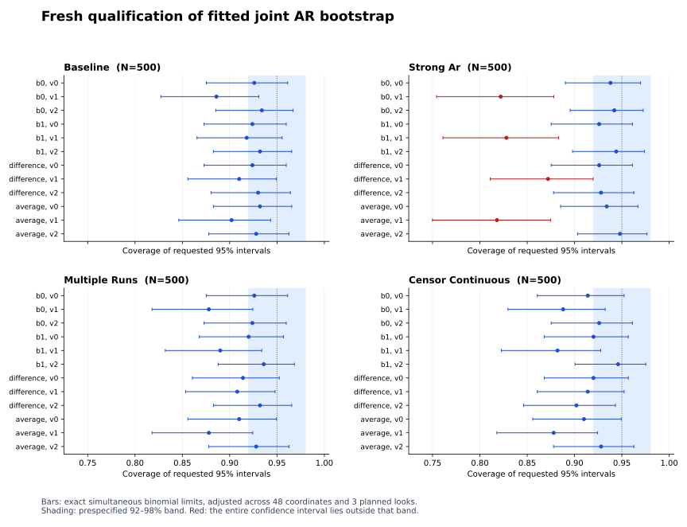

# Voxelwise RRG calibration investigation

Mote: `bd-01M3RP66GV5KKHCC0MTN1FBZ9K`. This follow-up refreshes integration,
diagnoses the interval undercoverage found in the
[previous qualification](voxelwise-ar-reduced-rank-gls.md), and evaluates one
diagnostic parametric-bootstrap candidate. No production inference API is added.

## Frozen question and candidate

The current estimator estimates voxelwise AR from unrestricted regression
residuals. At the default one iteration, these are OLS residuals. The residual
bootstrap generates around the restricted fitted mean but estimates noise from
unrestricted whitened GLS residuals. Its observed undercoverage therefore does
not establish contamination from rank-truncated residuals. AR estimation after
regression and run demeaning, estimated innovation covariance, and their
interaction with rank fitting remain plausible contributors.

The candidate uses a joint Gaussian diagonal AR(1) model on a small selected
voxel set. For each physical run,

```text
u_0 ~ N(0, Gamma)
u_t = diag(rho) u_(t-1) + epsilon_t,  epsilon_t iid N(0, Sigma)
Gamma[v,w] = Sigma[v,w] / (1 - rho[v] rho[w]).
```

Runs start independently. The latent process continues through omitted
observations and retained noise-exclusion rows; those exclusions do not create
physical resets. The fitting operator retains its existing whitening resets.
Gale owns the Cholesky factorizations. Nonfinite, unstable or non-positive-
definite parameters fail explicitly, without jitter or eigenvalue flooring.

The fitted candidate freezes original estimated AR coefficients and one
innovation covariance per run. Covariance uses synchronized unrestricted GLS
innovation residual vectors, marginal HC2 correction and run centering, with
sample denominator `K - 1`. Eligible rows have an immediately preceding
eligible observation inside the same noise-estimation segment. Segment starts
and pairs touching noise-exclusion rows are omitted from covariance estimation.
This covariance estimate remains an approximation; the study tests its adequacy.

Each replicate adds simulated noise to the original restricted fitted mean,
including nuisance coefficients, then re-estimates AR and refits the same fixed
rank. Coefficient and named contrast intervals use the same type-7 95%
percentile convention. There is no rank selection or posthoc variance factor.

## Diagnostic comparisons

Development reuses the original 400 baseline datasets, so these results are
exploratory. The eight new cells complete full-rank residual-bootstrap controls
and cross known/estimated estimator whitening with oracle/fitted Gaussian noise
generation at ranks one and two. Two additional rank-one controls on the first
100 datasets combine true AR with estimated innovation covariance and estimated
AR with true innovation covariance. All cells use 399 replicates. Oracle
parameters are diagnostic controls and must not become a user-facing estimator.

Responses are paired by their hashes. Report coefficient/contrast coverage
separately, both miss tails, bias, sampling and bootstrap variance, widths,
original AR error, mean bootstrap AR displacement, and stationarity-bound hits.
No coordinate pooling or replacement of failed fits is permitted.

Checks include the unrestricted mean-shift AR invariant, the stationary
Lyapunov identity, covariance-factor reconstruction, stochastic contemporaneous
and directional lag covariances, physical run/gap behavior, and an independent
[base-R path oracle](../../tools/r-parity/verify_voxelwise_ar_rrg_parametric.R).

## Prespecified fresh-data decision

The complete machine-readable specification is
[design.json](../audits/voxelwise-ar-rrg-calibration/design.json). It was recorded
before development or fresh simulation outcomes. Fresh seeds are disjoint from
development. Four regular settings cover baseline heterogeneous AR, strong AR,
multiple physical runs, and censor gaps with continuous latent noise. The
candidate uses 999 replicates and up to 2,000 datasets per setting.

The 12 coefficient/contrast coordinates in each of four settings form a fixed
48-coordinate family. Evaluate only when all four settings reach 500, 1,000 or
2,000 datasets. Exact two-sided Clopper–Pearson intervals use
`alpha = 0.05 / (48 * 3)`, controlling the family across coordinates and planned
looks without assuming independence.

- Reject calibration at a checkpoint if any adjusted interval lies wholly
  outside the operational coverage band `[0.92, 0.98]`.
- Permit no early acceptance. At 2,000 datasets, every adjusted interval must
  lie wholly inside the band, and every planned fit/replicate must succeed.
- Otherwise report an inconclusive final result. Do not enlarge the sample or
  relax the band after observing results.
- A numerical failure is a computational qualification failure, distinct from
  demonstrated undercoverage. A 7,200-second timeout is incomplete qualification.

A pass would support approximate calibration within the stated band for these
settings only. It would not establish exact nominal coverage or authorize
generic T/F inference. Weak signal, the rank boundary and lagged innovations
are separate descriptive stress tests, with 200 datasets and 399 replicates
each. A prespecified rejection completes this investigation without promoting
the candidate or starting an unbounded search for a passing method.

## Integration boundary

The integration candidate captures root commit `9504d6962fa39dbcbda27732e8f8291ab3259fbc`
plus 311 local source changes, then reconciles 27 RRG paths from
`8a18961a059be5b0339cefb51fd4d86958f83e00`. The only textual conflict was in writer
tests: retain the current NIfTI evidence convention and all added RRG contrast
checks. Resolution exists only in the isolated integration worktree. Shared
files and the other agent's writer reservation remain untouched. Later root
changes are outside this captured qualification.

## Development result

All 3,400 planned attempts completed all 1,356,600 replicates without a fit
failure. The same 400 baseline responses were used across the eight main arms;
the two cross-controls use the first 100. The three available archived point-fit
comparisons (estimated rank one, known-whitening rank one and full rank) reproduce
all 1,200 point-estimate vectors exactly. The independent reviewer recomputed all
120 coordinate coverage and variance-ratio summaries from the raw rows.

Across the 12 separately reported coordinates, coverage was 0.9325–0.9575 for
the oracle generator with refitted AR and rank one, versus 0.8925–0.9450 for the
fitted generator. Neither coordinate ranges nor development outcomes are an
acceptance test. At the previously selected `coefficient_1_voxel_1`:

| Noise generation / fitted rank | Datasets | Coverage | Bootstrap / empirical variance |
| --- | ---: | ---: | ---: |
| Fitted AR and covariance, rank one | 400 | 0.8925 | 0.750 |
| True AR and covariance, rank one | 400 | 0.9350 | 0.889 |
| Fitted AR and covariance, full rank | 400 | 0.9200 | 0.835 |
| True AR and covariance, full rank | 400 | 0.9475 | 1.008 |

All four rows refit AR in every replicate. For rank one, 21 datasets are covered
only by the oracle interval and 4 only by the fitted-generator interval: paired
coverage difference 0.0425, Monte Carlo SE 0.0123.

In the matched first-100 subset, coverage at that coordinate is 0.88 with both
parameters fitted, 0.95 with true AR and fitted covariance, 0.87 with fitted AR
and true covariance, and 0.95 with both parameters true. Replacing AR alone
changes coverage by +0.07 (paired MCSE 0.0256); replacing covariance alone changes
it by −0.01 (MCSE 0.0174). These small diagnostic controls support an AR-bias
hypothesis in this baseline; they do not prove covariance estimation irrelevant.

Original AR estimates average `[0.0560, 0.4226, -0.2313]`, versus truth
`[0.1, 0.5, -0.2]`. Refitting under the fitted generator adds an average downward
shift of `[-0.0429, -0.0681, -0.0235]`. Oracle generation approximately reproduces
the original estimator's average bias instead. No stationarity-bound hits were
recorded. The fitted innovation variance for voxel 1 averages 0.3562 versus 0.36;
its average accuracy does not establish accurate per-dataset or joint uncertainty.

Full-rank undercoverage rules out rank reduction as the sole explanation here.
The rank-one oracle variance ratio remains below one at the selected coordinate,
so rank-related finite-sample behavior and Monte Carlo uncertainty remain open.
The evidence supports studying AR bias next; it does not supply a validated
correction. The candidate was left unchanged for fresh qualification.

## Fresh decision: calibration rejected

The first prespecified checkpoint completed 500 datasets in each of four
settings: all 2,000 fits and all 1,998,000 bootstrap replicates succeeded. The
controller then stopped with **prespecified calibration rejection**. The later
1,000/2,000 checkpoints were not run. This is a statistical calibration failure,
not a numerical failure, timeout, or incomplete schedule.

| Fresh setting | Datasets | Coverage range across 12 separate coordinates |
| --- | ---: | ---: |
| Baseline | 500 | 0.886–0.934 |
| Strong AR | 500 | 0.818–0.948 |
| Multiple runs | 500 | 0.878–0.936 |
| Censor gaps, continuous latent noise | 500 | 0.878–0.946 |

Four strong-AR voxel-1 coordinates have simultaneous confidence intervals
wholly below the prespecified 0.92 lower boundary:

| Coordinate | Covered / attempted | Coverage | Adjusted exact interval |
| --- | ---: | ---: | ---: |
| Coefficient 0 | 411 / 500 | 0.822 | [0.7543, 0.8781] |
| Coefficient 1 | 414 / 500 | 0.828 | [0.7610, 0.8832] |
| Difference | 436 / 500 | 0.872 | [0.8110, 0.9196] |
| Average | 409 / 500 | 0.818 | [0.7499, 0.8747] |

These are the exact Clopper–Pearson limits adjusted across all 48 coordinates
and all three planned looks. Independent R recomputation agrees with every
count, interval and decision flag; the largest limit difference from SciPy is
1.12e-16. Absence of a rejection for another coordinate is not acceptance.



This fitted joint Gaussian AR bootstrap candidate is therefore **not admitted
for calibrated inference**. It remains a JVM diagnostic prototype. Existing fixed-rank
point-estimate support and explicitly labeled bootstrap outputs are unchanged;
nominal T/F inference, p-values and adaptive-rank inference remain unavailable
for compressed voxelwise execution. The full-rank GLS fallback remains available;
this study does not qualify all inference produced by that separate path.

The next methodological lead is finite-sample AR bias or bias-aware resampling,
with new held-out data for any future candidate. This investigation does not
introduce an untested correction or search further after the declared rejection.

## Verification

The captured integration passed `scalafimCompileAll` without warnings, 86 focused
JVM tests and 74 focused Scala.js tests. The new JVM diagnostic adds 15 passing
numerical tests; the Python evidence validator has 11 passing tests. The new
simulation driver is JVM-only test code, with no shared production API changes.

Independent base-R checks reproduce the deterministic noise path and exact
binomial limits. R and SciPy binomial limits agree within 1.12e-16. The numerical
tests also cover stochastic covariance and directional lag, stationary run starts,
latent continuation through gaps, deliberately different per-run laws, the
unrestricted fitted-mean AR invariant, HC2 run centering, type-7 percentiles,
full-rank GLS covariance, and explicit invalid-covariance refusal.

Shared sbt build-definition caches failed while loading graph4s and Gale. The
successful retry used task-local copies of the exact pinned sources; all copied
Git sources were clean. No shared cache was removed or repaired. The executable
classpath was copied and hashed before simulation. The smoke and timing-pilot
outputs are separate from the canonical development evidence and are never
counted as additional datasets.

## Separate stress results

All 600 stress attempts completed all 239,400 replicates without failure. Each
setting uses 200 datasets and 399 replicates. Coordinate-specific coverage ranges
are 0.850–0.935 for weak signal, 0.915–0.965 at the rank boundary, and 0.880–0.960
for lagged innovations. They are descriptive results outside the acceptance
family. They cannot overturn the fresh rejection, qualify boundary inference, or
justify retrospectively changing the candidate.

## Evidence

The [receipt](../audits/voxelwise-ar-rrg-calibration/receipt.json) binds counts,
checks, commands, source identities and artifact hashes. The full evidence is
retained with every attempted fit; no failures or coordinate outcomes were
removed:

- [Development summary](../audits/voxelwise-ar-rrg-calibration/development-summary.json)
  and [raw attempts](../audits/voxelwise-ar-rrg-calibration/development.jsonl.gz).
- [Fresh checkpoint and simultaneous limits](../audits/voxelwise-ar-rrg-calibration/fresh-500-summary.json),
  [raw attempts](../audits/voxelwise-ar-rrg-calibration/fresh-500.jsonl.gz), and
  [independent R verification](../audits/voxelwise-ar-rrg-calibration/fresh-r-verification.json).
- [Stress summary](../audits/voxelwise-ar-rrg-calibration/stress-summary.json)
  and [raw attempts](../audits/voxelwise-ar-rrg-calibration/stress.jsonl.gz).
- [Independent review](../audits/voxelwise-ar-rrg-calibration/review.md),
  [archived-point parity and recomputation](../audits/voxelwise-ar-rrg-calibration/development-independent.json),
  and [execution logs/controllers](../audits/voxelwise-ar-rrg-calibration/execution-logs.tar.gz).

Across the canonical development, fresh and stress stages, 6,000/6,000 attempts
completed 3,594,000/3,594,000 requested replicates. The investigation is complete
under its stopping rule; it yields a negative calibration result, not inference
admission. Changes are scoped to the diagnostic harness, checks and evidence.
No production policy was relaxed, and no merge or push was performed.

A reporting-only correction renamed an ambiguous input-count field and added the
number of distinct input seeds. The fresh checkpoint has 2,000 scenario/dataset
combinations but 500 shared input seeds; inference uses 500 datasets separately
per coordinate, never 2,000 pooled independent observations. The
[correction record](../audits/voxelwise-ar-rrg-calibration/reporting-correction.json)
verifies that all scientific metrics and decisions are identical after metadata
normalization. Original executed analysis code and summaries are retained in the
log archive; the frozen design and simulation executable were unchanged.


## Reproducibility and local integration

The report is bound to the captured source tree, not to an unspecified later
state of the shared checkout. Reconstruct it in an isolated checkout of
`9504d6962fa39dbcbda27732e8f8291ab3259fbc` using
[integration-source-overlay.tar.gz](../audits/voxelwise-ar-rrg-calibration/integration-source-overlay.tar.gz).
The [source manifest](../audits/voxelwise-ar-rrg-calibration/source-freeze.json)
lists final hashes; entries with a null hash are deletions. The input snapshot
records the root changes, prior RRG paths, and the isolated writer-test conflict
resolution. Dependency revisions and clean-source checks are retained separately.
This archive is evidence for replay; it is not a merge into the shared checkout.

The JVM entry point is `scalafim.fmri.fit.VoxelwiseReducedRankCalibration`, under
`fitJVM / Test`. It requires a new JSONL output path and accepts:

```text
development NEW.jsonl [count<=400]
fresh START COUNT NEW.jsonl
stress NEW.jsonl [count<=200]
```

For a fresh replay, preserve the checkpoint sequence and stop policy from
`design.json`; do not run all stages indiscriminately or concatenate overlapping
smoke/pilot/development records. The archived controller shows the exact executed
commands, bounds and checkpoint decisions. Every classpath entry was privately
copied and hashed; dependency class directories were not read live during the
simulations. The archived classpath manifest identifies the executable bytes.

The simulation environment is recorded in
[environment.json](../audits/voxelwise-ar-rrg-calibration/environment.json).
Simulations ran on OpenJDK 22, macOS ARM64, with a 3 GiB heap and
`ActiveProcessorCount=4`; numerical processes ran sequentially. sbt compilation
and test logs record their separate Homebrew Java 25.0.1 runtime. Elapsed times
are execution receipts, not a comparative performance benchmark.
