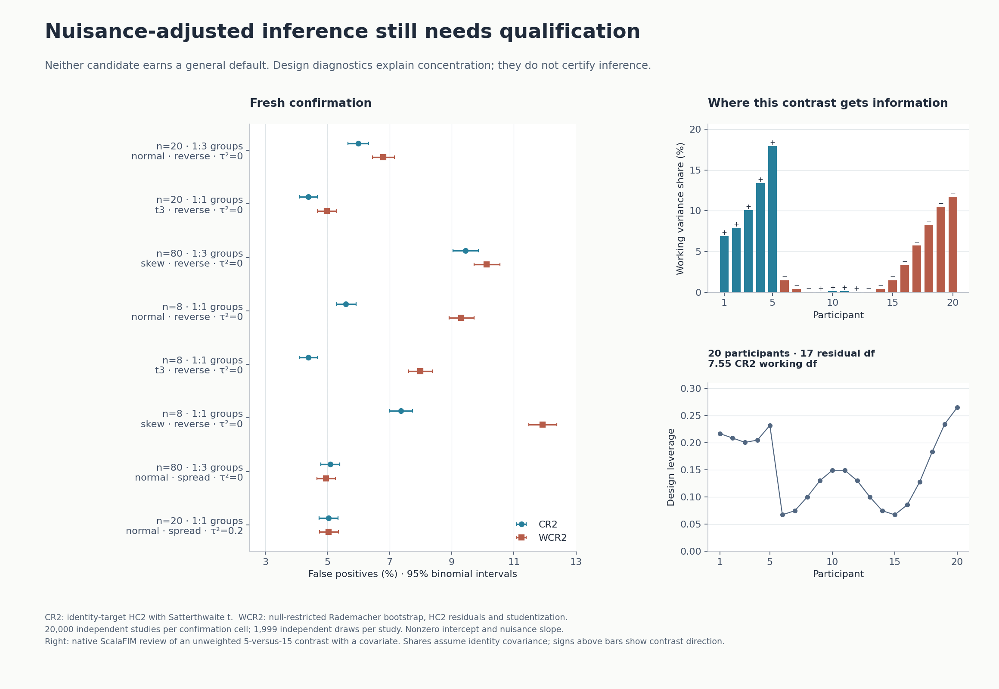

# Nuisance inference qualification and reusable contrast review

8 September 2026. Local provider candidate over ScalaFIM `72a35a46df661e6e8b0e8dd6bd7dbb59002ec9e4`.
Native issue `bd-01M213SW2EBKHYJ2QGZ7WVVMJC`; general inference admission
`bd-01M20TKX7VYFT3BHCM7QAMA6NG` stays open.

## Decision

Neither tested nuisance candidate is admitted as a general inference default.
CR2/Satterthwaite and the specified restricted wild bootstrap agree with
independent R calculations, but both retain excess false positives on fresh
confirmation. This is a statistical calibration limitation, not a discovered
formula implementation defect. No production p-value route or default was added.
Existing PM/mKH remains explicitly approximate and unchanged.

The completed production addition is `GroupContrastDiagnostics.review`:
subject-linked leverage, signed standardized contrast influence, identity-working
variance shares, residual df, effective contribution concentration and scalar
CR2 working information. It reuses Gale design preparation and named contrast
validation. It supplies no p-values or inference admission decision. A unit-leverage
subject remains reviewable with explicitly unavailable working information.

## Exact comparison

The estimand is the group indicator coefficient in the fixed linear mean
`E[Y|X] = 1.7 + beta_group * group + 0.8 * covariate`. Subjects are independent;
there is one outcome per subject at the tested sample. The covariate is
`cos((i + .5) * 2*pi/n)` and the group is the first half or first quarter (at
least two subjects). The named scalar contrast is tested at zero. Power uses
`beta_group=.7`; coverage explicitly tests the true nonzero value `.7` after
shifting the same realization. These paired uses do not multiply the independent
study count. No confidence interval endpoint or joint F test is implemented.

Methods:

- **CR2**: equal-subject OLS, singleton-subject CR2 with identity working
  covariance (HC2), and the contrast-specific Satterthwaite t approximation.
- **WCR2**: equal-subject OLS; fit under the scalar null, adjust restricted
  residuals by `sqrt(1-h_restricted)`, multiply by independent Rademacher signs,
  refit the full model and use HC2 studentization. The Monte Carlo two-sided
  p-value is `(1 + exceedances)/(1 + draws)`, with a `1e-12` tie tolerance in
  statistic units. The observed statistic also uses HC2. The shorthand WCR2 is
  local to this report, not a claim about all wild-bootstrap variants.
- **OLS**: conventional residual-df t baseline, retained in the full records.

Under the identity working model, with `M=I-QQ'`, normalized scalar contrast
influence `a`, leverage `h` and `B=M diag(a_i^2/(1-h_i)) M`, the diagnostic is
`tr(B)^2 / tr(B^2)`. It need not equal residual df. The native implementation
accumulates nonnegative squared terms without an n-by-n allocation; it reuses
Gale QR rather than implementing another factorization.

The [clubSandwich coefficient tests](https://jepusto.github.io/clubSandwich/reference/coef_test.html)
and [lm covariance documentation](https://jepusto.github.io/clubSandwich/reference/vcovCR.lm.html)
define the independent reference. The finite-sample caution is consistent with
[Preinerstorfer and Pötscher's bootstrap analysis](https://arxiv.org/abs/2005.04089).
These sources do not certify this particular grid; the retained experiments do.

## Calibration

The pre-run Mote protocol and initial executable source are retained. The
108-cell pilot crosses n=8/20/80, balanced/quarter groups, variance profiles
spread/reverse/outlier, normal/symmetric t3/skew errors, and additive variance
0/.2. Spread variances run from .04 to 1; reverse reverses this order; outlier
assigns 10 to the first subject and .04 to the rest. Errors have variance one:
normal, t3 divided by sqrt(3), or centered/standardized lognormal with log-SD 1.
The marginal error is multiplied by `sqrt(v_i + tau2)`. For nonnormal errors,
this is a marginal variance experiment, not a separately simulated Gaussian
random-effect hierarchy.

There are **216,000 independent pilot studies** (2,000/cell; 499 draws/study) and
**160,000 fresh confirmation studies** (20,000/cell; 1,999 draws/study). Outcome
and action roots are 2026091301/02 and 2026091401/02. NumPy SeedSequence expands
root and cell index; every study has independent errors and actions. No shared
plan creates clusters of dependent simulation decisions.

The eight confirmation cells were selected after the pilot: the largest null
rate for each candidate/error family, plus the original n80 quarter-group spread
normal design and a balanced normal comparator. The n80 quarter reverse skew
case duplicates one selected maximum. These are deliberately adverse confirmation
cases, not an estimate of average performance over all possible designs.

| n, grouping, variance, errors, additive variance | CR2 null | WCR2 null | CR2 power | WCR2 power |
| --- | ---: | ---: | ---: | ---: |
| 20, quarter, reverse, normal, 0 | 5.990% | 6.795% | 29.525% | 30.170% |
| 20, balanced, reverse, t3, 0 | 4.385% | 4.975% | 66.505% | 67.305% |
| 80, quarter, reverse, skew, 0 | 9.440% | 10.130% | 95.720% | 97.565% |
| 8, balanced, reverse, normal, 0 | 5.595% | 9.310% | 22.135% | 30.065% |
| 8, balanced, reverse, t3, 0 | 4.385% | 7.990% | 33.230% | 44.020% |
| 8, balanced, reverse, skew, 0 | 7.365% | 11.930% | 40.290% | 57.575% |
| 80, quarter, spread, normal, 0 | 5.090% | 4.955% | 89.960% | 89.490% |
| 20, balanced, spread, normal, 0.2 | 5.030% | 5.040% | 41.360% | 41.270% |

Power is descriptive at the nominal .05 threshold. A method's apparent power
advantage is not a fair superiority claim when its false-positive rate is inflated.

All 376,000 true-nonzero-null coverage checks returned exactly the complement of
the matched null rejection count for all three methods. Maximum shift-induced
p-value differences were 1e-14. All tested p-values were finite. Inverted-test
coverage, not computed confidence interval endpoints, is the coverage estimand.

The admission regression uses one-sided Clopper–Pearson lower limits with
99.9% family confidence across two candidates and every cell within each stage.
Pilot failures: CR2 in 9 cells, WCR2 in 26. Fresh confirmation failures: CR2 in
3 cells, WCR2 in 5. Pointwise 95% intervals are used only in the figure. Passing
`verify.py` means these numerical identities and the known admission failures
are reproduced; it does not label failed inference as calibrated.

These candidates ignore first-level SE weights. Varying independently supplied
SE estimates cannot affect them, so the study does not duplicate cells by an
unused SE-df factor. It does not qualify precision-weighted nuisance inference,
first-level effect/SE dependence, repeated-subject clusters, F contrasts,
model-selected ROIs, spatial multiplicity or arbitrary covariate distributions.

## Native correctness and speed

All **293 test executions passed**: group JVM 97, group JS 97, workflow JVM 55,
workflow JS 44. Seven new portable tests cover 18 independent clubSandwich df
fixtures, analytical intercept geometry, subject leverage/influence, subject
reordering, equivalent design recoding, contrast reflection and extreme units,
unit leverage and typed malformed/rank/contrast refusals. Scala 3.7.4, sbt 1.11.7.

Independent R 4.5.1 / clubSandwich 0.7.0 agrees with NumPy to at most 1.6e-13 for
df, 1.9e-15 for covariance and 4.5e-16 for p-values on the selected coefficient.
The native fixtures additionally cover every coefficient's df. An explicit
256-action R `lm`/`vcovCR` bootstrap oracle matches each bootstrap statistic to
3.3e-14 and the final count/p-value exactly. No common seed is used for parity.
Native exported plot rows agree with R by subject identity.

Three sequential fresh JVM forks per n, each with 20 warmups and 50 measured
reviews, measured the public design/contrast review. Input construction precedes
timing. No owned fit, test or calibration job overlapped these benchmark forks.
The later coverage replay started after all forks finished. Median averages:

| Subjects | Warm wall/review | Warm thread CPU/review | Warm thread allocation/review | Cold review range |
| ---: | ---: | ---: | ---: | ---: |
| 20 | 0.670 ms | 0.297 ms | 18,496 B | 93.8–242.4 ms |
| 80 | 2.152 ms | 0.738 ms | 58,227 B | 109.7–176.2 ms |
| 200 | 1.981 ms | 0.778 ms | 143,072 B | 81.8–176.0 ms |

Shared-host load was high and variable; these are bounded preview measurements,
not a scaling claim or whole-brain fitter benchmark. Thread allocation is not
RSS. Apple arm64, macOS 14.3, JDK 25.0.1; exact host/commands and outputs are
retained. Python 3.14.7; NumPy 2.4.3, SciPy 1.17.1, Matplotlib 3.10.8.

Tests ran in the existing isolated provider candidate with the audit dependency
graph. All 65 compared native group/workflow Scala source files matched the
candidate byte-for-byte, including the new suite. The current native whole-tree
build and app dependency bundle were not requalified or adopted. Existing
unrelated checkout changes were preserved. This is local JVM/JS/consumer proof,
not hosted CI, a commit, publication or product UI acceptance.

## Visual review

The implementing agent inspected the actual figure, rejected v1 for overlapping
footer text, an overly long panel title and rendering before the eighth cell
finished, then inspected the corrected 2320×1600 image. The renderer now requires
eight complete confirmation cells. Versioned artifacts, hashes, input receipts
and rubric are retained in `visual-review.json`. No native application UI was
changed or screenshot, and no independent UX reviewer approval is claimed.

## Next work

1. Preserve real first-level uncertainty provenance/df and run-combination
   semantics (`bd-01M210WJ4BWVCXEMTARHDR2AC7`). Do not infer those from an SE alone.
2. Predeclare further nuisance candidates: leverage/HC3 corrections, suitable
   working covariance targets, multiplier and studentization choices. Retain
   these failure cases and require fresh confirmation, including scalar/joint
   targets and coverage. This report does not reject other variants without tests.
3. Adopt the exact native review contract through the registered app method and
   linked participant/contrast plots, keeping participant count, residual df,
   working information and actual precision distinct. That integration remains
   open in PLS Neuro `bd-01M20V5F314V68XNY9SHDY4RR0`.
4. Qualify F tests, spatial families and streaming execution separately. The
   one-sample symmetry guarantee remains bounded to its previously admitted design.

Reproduction: [tools/group-nuisance](../../tools/group-nuisance/README.md).
The accompanying `group-nuisance-2026-09-08.json.gz` retains all scientific
records, source, commands, logs and visual evidence; its SHA is recorded in Mote.
