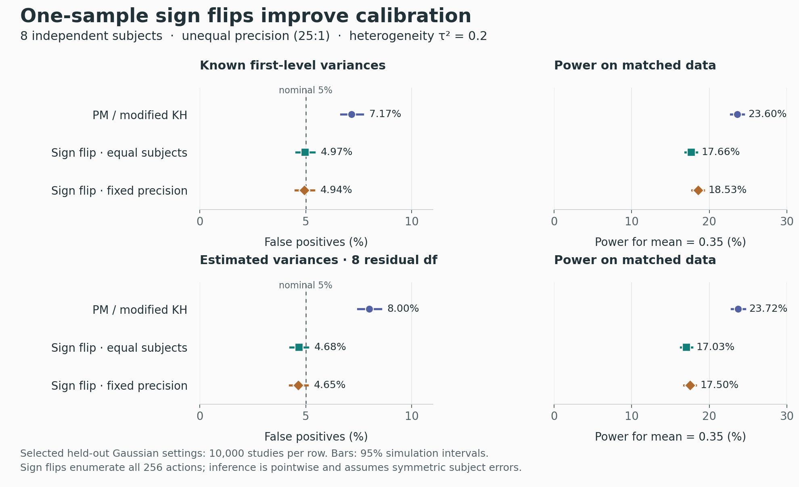

# One-sample group symmetry qualification — 8 September 2026

ScalaFIM now provides a bounded, separately named alternative to PM/mKH inference:
**two-sided common-center sign flips for independent symmetric subject errors**.
Fresh simulations support the admitted one-sample contract. General nuisance-
adjusted GLM admission remains open; the PM/mKH formula and compatibility defaults
are unchanged. These are local, uncommitted changes over native HEAD
`72a35a46df661e6e8b0e8dd6bd7dbb59002ec9e4`, extending the
[previous repair](group-repair-2026-09-08.md).

## Scientific contract and implementation

One valid first-level contrast map per independent subject is required. The
intercept-only design is checked explicitly. The null is a common center μ₀
with symmetric subject errors conditional on selection and, if used, precisions.
This permits unequal variances and symmetric heterogeneity; a zero average
across arbitrary asymmetric populations is insufficient. With finite means the
common center is the common mean. A paired question must already be a valid
within-person contrast; extra rows, runs, conditions or FIR coefficients do not
create independent participants.

For fixed weights, define aᵢ = wᵢ(yᵢ−μ₀). Rank the magnitude of the signed sum
against its sign orbit, with score Σaᵢ/√Σaᵢ². The denominator is invariant.
Exact enumeration includes all 2ⁿ actions for 2–16 subjects; the two-sided
p-value floor is 2/2ⁿ before additional ties. Monte Carlo uses independent
uniform actions with replacement and the observed identity,
`p = (1 + exceedances)/(1 + draws)`. Conditional sign invariance makes the
observed position exchangeable on the orbit; ranking with ties is conservative.
The identity correction follows the finite-randomization argument in
[Hemerik and Goeman](https://link.springer.com/article/10.1007/s11749-017-0571-1).
See also [Winkler et al.](https://pmc.ncbi.nlm.nih.gov/articles/PMC4010955/) for the
neuroimaging distinction between symmetry, exchangeability and nuisance handling.

`GroupSymmetryWeighting.EqualSubjects` needs no first-level SE. The explicit
`FixedInverseVariance` option uses supplied precisions held fixed under all
actions; their conditional sign invariance must be justified. No plug-in τ² or
normal/t reference is needed by this test. Results carry a descriptive weighted
mean and normalized score, **not a fabricated parametric SE, t map or interval**.

`GroupSignFlipPlan` binds canonical subject IDs, versioned resample4s streams,
seed/draws and bounded sign-cache allocation. Reordering rows preserves the
realized experiment; the same plan can serve spatial blocks. The existing native
resample4s `6bc4172a966c92f1b06811eac64ac2bada9fef9b` pin supplies random generation;
no general RNG or solver is duplicated. The initially explored Multivar action
integration was declined before calibration because the native Multivar pin
predates it and its upgrade would unnecessarily widen this change.

Results retain method identity, assumptions, null center, subject/sample axes,
weighting, sampling, p-value resolution, counts and identified failures.
Unrepresentable precision ratios fail explicitly; all-failed maps return `Left`.
All-zero residuals produce score 0 and p=1. Stable scaling prevents overflow,
and conservative tie handling avoids turning rounding noise into significance.

## Independent and portable checks

Final ordinary suites: **90 group tests on JVM + 90 on JavaScript + 55 workflow
on JVM + 44 on JavaScript = 279 passing executions**. All 63 group/workflow Scala
source files match the tested isolated provider candidate byte-for-byte.

The new suite checks a rational/60-digit Python oracle, independent decimal
full-orbit enumeration, rejection counts over every member of a heterogeneous
256-element null orbit, identity correction and ties, exact p-value granularity,
subject reorderings, reflection/units/shifted nulls, spatial-block reuse,
zero/extreme maps, precision failures, duplicate/foreign IDs, byte/draw limits
and refusal of nuisance/nonconstant designs. Both platforms passed after the
final inner-loop refinement. The public sbt tool-loading command also completed
its small calibration smoke. The smoke is not calibration evidence.

Tests use the prior isolated audit's exact dependency inputs plus the existing
resample4s core pin; the native build adds that core dependency to group on both
platforms. This is not `testAll`, hosted CI or application acceptance.

## Held-out calibration and power

The [predeclared protocol](../../tools/group-symmetry/protocol.md) freezes the
estimand, assumptions, methods and gate before results. The new grid has 108
settings: n=8/20/80; known variances or independent chi-square estimates with
df8/40; true τ²=0/.2/1; Gaussian or variance-one symmetric t3 errors; smoothly
unequal precision (.04..1 variance) or one dominant subject (.01 versus 1).

There are **504,000 independent error/variance realizations**: 10,000 per n8
setting, 2,000 per larger-n setting. Each supplies a null, a shifted true-center
question (μ₀=.7), and an alternative (μ=.35); these paired questions are not
independent replications. Exact n8 signs and 999 Monte Carlo draws at n20/80 use
new outcome/action seed roots. Larger-n settings use 100 independent plans with
20 studies per plan. The receipt retains all batch counts; uncertainty is
clustered by plan rather than pretending every Monte Carlo experiment is
independent. No reported-sample failures occurred. The complete run took 78.8 s.

Selected n8 Gaussian settings, τ²=.2, variances .04..1; 95% exact binomial
simulation intervals:

| First-level variance | Method | False positives at .05 | Simulation interval |
| --- | --- | ---: | ---: |
| Known | PM-mKH | 7.17% | 6.67–7.69% |
| Known | EqualSubjects | 4.97% | 4.55–5.41% |
| Known | FixedInverseVariance | 4.94% | 4.52–5.38% |
| Estimated, df8 | PM-mKH | 8.00% | 7.48–8.55% |
| Estimated, df8 | EqualSubjects | 4.68% | 4.27–5.11% |
| Estimated, df8 | FixedInverseVariance | 4.65% | 4.25–5.08% |

Across the whole grid, equal-subject sign rejection ranged from 3.95% to 6.45%,
and fixed-precision sign rejection from 3.80% to 6.30%. The largest deviations
come from the smaller 2,000-study Monte Carlo cells. None of the 432 predeclared
null/coverage comparisons had a Bonferroni one-sided 99.9% simultaneous lower
bound above .05 (largest bound 4.13%). Exact cells use Clopper–Pearson bounds;
shared-plan cells use a t approximation across independent plan batches. This
simulation screen corroborates the invariance argument; it does not prove
validity by accepting a null hypothesis. Unfavorable cells remain in the receipt.

A separate confirmation uses **20,000 fresh studies and 1,999 draws**, with 500
independent plans, for the grid's largest Monte Carlo deviation: n80, df8, t3
errors, dominant precision, τ²=1. Its outcome and action seed roots differ from
the grid. Plan-clustered 95% simulation intervals:

| Method | False positives at .05 | Simulation interval |
| --- | ---: | ---: |
| PM-mKH | 6.075% | 5.74–6.41% |
| EqualSubjects | 4.805% | 4.50–5.11% |
| FixedInverseVariance | 5.090% | 4.78–5.40% |

All 216 shifted-null rejection counts equal the corresponding null counts;
confirmation coverage is 95.195% for equal weighting and 94.910% for fixed
precision. This is **confidence-set coverage by test inversion**. Endpoint
computation and connectedness are not implemented or claimed.

Power is descriptive, not size-adjusted. In the known-variance n8 setting above,
PM/mKH rejects the alternative 23.60%, equal signs 17.66%, and fixed-precision
signs 18.53%; PM/mKH's higher null rejection prevents calling this a fair power
advantage. In confirmation, power is 65.35%, 66.275%, and 49.74%, respectively.
Precision weighting can lose power when within-subject precision poorly reflects
total variation. The expanded symmetric heavy-tail grid also exposes much
larger PM/mKH inflation (up to 27%); it is not a universally robust reference.

## Completed map performance

Apple M3 Max (14 logical CPUs, 36 GiB), macOS 14.3, OpenJDK 25.0.1, heap 3 GiB,
four active JVM processors. Twelve sequential fresh forks cover two shapes and
two weightings, with three warmups and five measured fits each: **60 completed
measured maps**. All estimates/scores/p-values are checked after timing, with
identical checksums across forks. Each fit uses 999 Monte Carlo draws; plan
construction is separate. Entries are medians of three fork medians.

| Subjects | Samples | Weighting | Wall s | Thread CPU s | Allocation MB/fit | Cached signs KB |
| ---: | ---: | --- | ---: | ---: | ---: | ---: |
| 20 | 200,000 | EqualSubjects | 1.978 | 1.779 | 18.93 | 19.98 |
| 20 | 200,000 | FixedInverseVariance | 1.947 | 1.799 | 18.97 | 19.98 |
| 80 | 20,000 | EqualSubjects | 0.997 | 0.896 | 1.93 | 79.92 |
| 80 | 20,000 | FixedInverseVariance | 0.983 | 0.912 | 1.93 | 79.92 |

Cold plan construction medians were .073–.125 s, allocating 4.15–8.32 MB;
retained sign caches were only 19.98/79.92 KB. Map allocation includes output
construction. It is not RSS, and inputs remain resident. No draws-by-samples
null distribution is retained. A pre-calibration inner-loop refinement removed
repeated public bounds checks from the byte traversal; the final method was
retested and the complete grid rerun. An interrupted exploratory run is excluded.
No fitting/calibration jobs from this session overlap these benchmark forks.
The shared host remained busy (post-run load 167/188/191); wall times are measured
examples, not an SLA or a claim about IO/rendering speed.

## Admission, limits and next work

- The bounded one-sample method is implemented and qualified under its explicit
  assumptions. General nuisance-adjusted comparisons, repeated-row GLMs and
  general T/F contrasts remain unadmitted. No raw-residual sign-flip fallback.
- Pointwise p-values are distinct from spatial FWER/FDR and cluster inference.
  A common plan across blocks does not by itself establish max-statistic validity.
- First-level SE/df/serial-noise/combination provenance and geometry need native
  receipts: `bd-01M210WJ4BWVCXEMTARHDR2AC7`. SE availability is not proof of
  conditional symmetry; voxel indices are not proof of co-registration.
- Next qualify nuisance-aware candidates under general admission
  `bd-01M20TKX7VYFT3BHCM7QAMA6NG`; compare null-restricted studentized wild
  bootstrap and CR2/Satterthwaite against independent references and new designs.
  Manifest-backed execution remains `bd-01KX6G9BFJRERNFRWR17WT0YGN`.
- PLS Neuro adoption remains `bd-01M20V5F314V68XNY9SHDY4RR0`. Its
  [delivery plan](../../../plsneuro/docs/group-glm-inference-plan.md) links typed
  method registration, uncertainty review, plots, inference resolution and
  native visual acceptance. No application UI or automatic universal default
  is shipped by this provider slice.

The static figure was actually opened and reviewed. A clipped title and ambiguous
label in the first export were repaired; the final artifact passed implementer
review. [Review records](../../tools/group-symmetry/visual-review.json) retain
hashes, scope, ratings and the rejected specimen. This is not independent UX
expert or native application acceptance.

## Reproduction

[Tools and commands](../../tools/group-symmetry/README.md) reproduce the numerical
reference, calibration, summary/plot and benchmarks. The compressed
[receipt](group-symmetry-2026-09-08.json.gz) retains commands, complete counts,
source/runtime hashes, logs, final source equality, the original grid tool source
and later confirmation variant, and plot reviews. The preceding repair receipt
remains unchanged. Native qualification ticket: `bd-01M20ZKKKKVAH6TPTYR05V53CX`.
